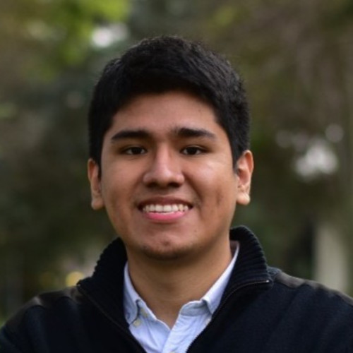

# Capitulo I: Introducción

## 1.1. Startup Profile

### 1.1.1. Descripción de la Startup

PsyMed es una plataforma web creada para optimizar la gestión del monitorio del estado de los pacientes en centros psiquiátricos. La plataforma permite la comunicación de manera continua entre los pacientes y sus psiquiatras, permitiendo un monitoreo completo del progreso de los tratamientos. Además, brindar una sistema que gestione las citas y notas clínicas. PsyMed busca mejorar la calidad de la atención de los usuarios proporcionandoles herramientas que permitan a los psiquiatras, poder mantenerse conectados con sus pacientes de manera efectiva y con información actualizada de manera constante.

<table>
    <thead>
        <tr>
          <th>Misión</th>
          <th>Visión</th>
          <th>Valores</th>
        </tr>
    </thead>
    <tbody>
      <tr>
        <th>Brindan a los psiquiatras una plataforma optima para el seguimiento de los tratamientos personalizado de los pacientes, proporcionandoles una gestión eficiente de la información de los mismos.</th>
        <th>Ser la principal plataforma de gestión de datos de pacientes optimizadas para el uso de los psiquiatras.</th>
        <th>
          Confidencialidad: Garantizar a los clientes de la protección de los datos proporcionados.
          Innovación: Mejorar el servicio continuamente para proporcionar una plataforma actualizada.
        </th>
      </tr>
    </tbody>
</table>

### 1.1.2. Perfiles de integrantes del equipo

<table>
    <thead>
        <tr>
            <th>Integrantes</th>
            <th>Foto</th>
            <th>Descripción del perfil</th>
        </tr>
    </thead>
    <tbody>
        <tr>
            <td>Aru Acevedo, Yair Christofer</td>
            <td></td>
            <td>Estudiante de la carrera de ingenieria de Software en la UPC. Tiene conocimientos en los lenguajes de C++, Java, Python, Javascript y Typescript.</td>
        </tr>
        <tr>
            <td>Astuyauri Herencia, Jhomar Cristian Elias</td>
            <td></td>
            <td>Actualmente realizo mis prácticas preprofesionales como Technical Product Owner en Ticketmaster Perú, donde colaboro con equipos de desarrollo para mejorar productos digitales. He trabajado con Java y Angular en proyectos personales y he tenido la oportunidad de aportar en iniciativas Open Source de amigos. Me interesa profundizar en el flujo de trabajo detrás del desarrollo de software y aprender técnicas que me ayuden a ser un mejor desarrollador.</td>
        </tr>
        <tr>
            <td>Ccotarma Ttito, Eduardo Eusebio Sihuar</td>
            <td></td>
            <td>Soy estudiante de la carrera de Ing de software, Me gusta mucho el mundo de la informática, tecnología y los videojuegos. De vez en cuando diseño pequeños proyectos de juegos como replicar mecánicas o interfaces que me parecen interesantes. También me gusta viajar y la música. Estoy comprometido a apoyar al grupo lo mejor posible.</td>
        </tr>
        <tr>
            <td>Chavez Uribe, Ario Joel</td>
            <td></td>
            <td>Soy estudiante de la carrera de Ingeniería de Software. Tengo interés en aprender sobre nuevas tecnologías, el desarrollo web y de aplicaciones. Además, tengo conocimientos en los lenguajes de programación como: C++, Python, Typescript. Útiles para el desarrollo y solución del proyecto.</td>
        </tr>
        <tr>
            <td>Seminario Castillo, Diego Vicente</td>
            <td></td>
            <td>Estudiante de la carrera de ingenieria de Software</td>
        </tr>
        <tr>
            <td>Prudencio Alcantara, Joel</td>
            <td></td>
            <td>Estudiante de la carrera de ingenieria de Software</td>
        </tr>
    </tbody>
</table>
