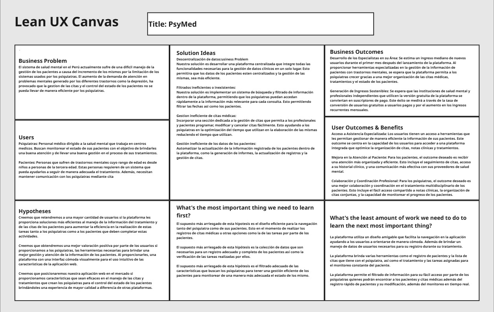

# Capitulo I: Introducción

## 1.1. Startup Profile

### 1.1.1. Descripción de la Startup

PsyMed es una plataforma web creada para optimizar la gestión del monitorio del estado de los pacientes en centros psiquiátricos. La plataforma permite la comunicación de manera continua entre los pacientes y sus profesionales de salud mentals, permitiendo un monitoreo completo del progreso de los tratamientos. Además, brindar una sistema que gestione las citas y notas clínicas. PsyMed busca mejorar la calidad de la atención de los usuarios proporcionandoles herramientas que permitan a los profesionales de salud mentals, poder mantenerse conectados con sus pacientes de manera efectiva y con información actualizada de manera constante.

<table>
    <thead>
        <tr>
          <th>Misión</th>
          <th>Visión</th>
          <th>Valores</th>
        </tr>
    </thead>
    <tbody>
      <tr>
        <th>Brindan a los profesionales de salud mentals una plataforma optima para el seguimiento de los tratamientos personalizado de los pacientes, proporcionandoles una gestión eficiente de la información de los mismos.</th>
        <th>Ser la principal plataforma de gestión de datos de pacientes optimizadas para el uso de los profesionales de salud mentals.</th>
        <th>
          Confidencialidad: Garantizar a los clientes de la protección de los datos proporcionados.
          Innovación: Mejorar el servicio continuamente para proporcionar una plataforma actualizada.
        </th>
      </tr>
    </tbody>
</table>

### 1.1.2. Perfiles de integrantes del equipo

<table>
    <thead>
        <tr>
            <th>Integrantes</th>
            <th>Foto</th>
            <th>Descripción del perfil</th>
        </tr>
    </thead>
    <tbody>
        <tr>
            <td>Aru Acevedo, Yair Christofer</td>
            <td></td>
            <td>Estudiante de la carrera de ingenieria de Software en la UPC. Tiene conocimientos en los lenguajes de C++, Java, Python, Javascript y Typescript. Además tiene un dominio del ingles intermedio. Está interesado en el uso de nuevas tecnologias para la ciberseguridad.</td>
        </tr>
        <tr>
            <td>Astuyauri Herencia, Jhomar Cristian Elias</td>
            <td></td>
            <td>Actualmente realizo mis prácticas preprofesionales como Technical Product Owner en Ticketmaster Perú, donde colaboro con equipos de desarrollo para mejorar productos digitales. He trabajado con Java y Angular en proyectos personales y he tenido la oportunidad de aportar en iniciativas Open Source de amigos. Me interesa profundizar en el flujo de trabajo detrás del desarrollo de software y aprender técnicas que me ayuden a ser un mejor desarrollador.</td>
        </tr>
        <tr>
            <td>Ccotarma Ttito, Eduardo Eusebio Sihuar</td>
            <td></td>
            <td>Soy estudiante de la carrera de Ing de software, Me gusta mucho el mundo de la informática, tecnología y los videojuegos. De vez en cuando diseño pequeños proyectos de juegos como replicar mecánicas o interfaces que me parecen interesantes. También me gusta viajar y la música. Estoy comprometido a apoyar al grupo lo mejor posible.</td>
        </tr>
        <tr>
            <td>Chavez Uribe, Ario Joel</td>
            <td></td>
            <td>Soy estudiante de la carrera de Ingeniería de Software. Tengo interés en aprender sobre nuevas tecnologías, el desarrollo web y de aplicaciones. Además, tengo conocimientos en los lenguajes de programación como: C++, Python, Typescript. Útiles para el desarrollo y solución del proyecto.</td>
        </tr>
        <tr>
            <td>Seminario Castillo, Diego Vicente</td>
            <td></td>
            <td>Estudiante de la carrera de ingenieria de Software</td>
        </tr>
        <tr>
            <td>Prudencio Alcantara, Joel</td>
            <td></td>
            <td>Estudiante de ingenieria de software, apasionado por involucrarse en proyectos desafiantes de programación, con experiencia en soporte técnico y el desarrollo de programas utilizando c++, javascript y typescript</td>
        </tr>
    </tbody>
</table>

## 1.2. Solution Profile

### 1.2.1. Antecedentes y problemática

Para el análisis de los antecedentes y la problemática, se utilizara la técnica de las 5W y 2H.

<table>
    <tr>
        <td> Who (Quiénes) </td>
        <td>El problema afecta a los profesionales de salud mentals, pacientes con trastornos mentales, y al sistema de salud en general.</td>
    </tr>
    <tr>
        <td> What (Qué) </td>
        <td>A pesar de las políticas de salud pública que han dado mayor importancia a la salud mental, el sistema sigue siendo incapaz de atender a la gran mayoría de la población afectada por trastornos mentales, como la depresión y la ansiedad.</td>
    </tr>
    <tr>
        <td> Where (Dónde) </td>
        <td>Esta problemática es particularmente visible en Perú, donde el Ministerio de Salud y la Defensoría del Pueblo han documentado una grave falta de recursos en las instituciones de salud mental.</td>
    </tr>
    <tr>
        <td> When (Cuándo) </td>
        <td>El déficit en la atención de la salud mental ha sido un problema desde al menos 2016, y se ha agravado en los últimos años, especialmente desde 2021, cuando se reportaron más de un millón de casos de problemas de salud mental.</td>
    </tr>
    <tr>
        <td> Why (Por qué) </td>
        <td>La saturación del sistema de salud y la falta de recursos humanos y financieros son las principales causas de este problema, lo que resulta en que 8 de cada 10 personas no reciban la atención que necesitan.</td>
    </tr>
    <tr>
        <td> How (Cómo) </td>
        <td>El déficit se manifiesta en la escasez de profesionales especializados en salud mental (solo 2 a 3 médicos por cada 100,000 habitantes), y en la carga administrativa que enfrenta el personal médico, lo que dificulta aún más la prestación de atención adecuada.</td>
    </tr>
    <tr>
        <td> How much (Cuánto) </td>
        <td>La magnitud del problema es alarmante, con más de 1 millón de personas afectadas que no reciben la atención necesaria, lo que representa un desafío urgente para el sistema de salud.</td>
    </tr>
</table>

Con esto, determinamos nuestra problemática:

El sistema de salud mental en el Perú actualmente sufre de una dificil manejo de la gestión de los pacientes a causa del incremento de los mismos por la limitación de los sistemas usados por los profesionales de salud mentals. El aumento de la demanda de atención en problemas mentales generado por los diferentes trastornos como la depresión, ha provocado que la gestion de las citas y el control del estado de los pacientes no se pueda llevar de manera eficiente por los profesionales de salud mentals.
### 1.2.2. Lean UX Process

#### 1.2.2.1. Lean UX Problem Statements

El estado actual de la gestión de pacientes en centros de salud mental en el Perú se ha centrado principalmente en atender casos de pacientes mediante sistemas fragmentados, herramientas poco especializadas y una alta carga administrativa para los profesionales.

Lo que los productos y servicios existentes no logran abordar es la necesidad de un sistema digital unificado que permita monitorear de forma continua el estado de los pacientes, facilite la colaboración entre profesionales, y automatice procesos clave como las citas y el registro clínico.

Nuestro producto, PsyMed, abordará esta brecha mediante una plataforma web centralizada que conecta a psiquiatras con sus pacientes, optimiza el registro clínico, y mejora la gestión de citas y seguimiento terapéutico.

Nuestro enfoque inicial se centrará en psiquiatras de instituciones públicas y privadas que enfrentan una alta carga de pacientes y dificultades para dar seguimiento adecuado a sus tratamientos.

Sabremos que hemos tenido éxito cuando observemos una mayor eficiencia en el seguimiento de pacientes, reducción en el tiempo dedicado a tareas administrativas, y una mejora en la continuidad del tratamiento según lo percibido por los profesionales.

#### 1.2.2.2. Lean UX Assumptions

Bussiness Assumptions:

- **Creemos que nuestros clientes tienen la necesidad de:**
Organizar y gestionar de manera eficiente la información de los pacientes, citas, y datos clínicos.

- **Estas necesidades se pueden satisfacer con:**
Una plataforma centralizada y específica para las instituciones de salud mental, que optimice sus procesos internos, reduzca errores y mejore la calidad de la atención.

- **Nuestros clientes iniciales son (o serán):**
Instituciones de salud mental que buscan modernizar y centralizar su gestión de información.

- **El valor principal que un cliente quiere obtener de nuestro servicio es:**
Eficiencia operativa y reducción de errores en la gestión de información clínica.

- **Los clientes también pueden obtener estos beneficios adicionales:**
Mejora en la calidad del servicio, mayor seguridad de los datos y una mejor coordinación entre profesionales.

- **Adquiriremos a la mayoría de nuestros clientes a través de:**
La venta de licencias de uso del software y tarifas de suscripción mensuales.

- **Ganaremos dinero mediante:**
Ofreciendo módulos adicionales de la plataforma, como la integración con sistemas de facturación o la expansión de la capacidad de almacenamiento de datos.

- **Nuestra competencia principal en el mercado será:**
Plataformas de gestión médica que no están especializadas en salud mental.

- **Les superaremos debido a:**
Nuestro enfoque especializado y las funcionalidades integradas que abordan las necesidades específicas de las instituciones de salud mental en particular.

- **El mayor riesgo para nuestro producto es:**
Que la funcionalidad de gestión de citas no se integre correctamente con el resto de la plataforma o que las instituciones no perciban un valor claro en la adopción de una nueva plataforma tecnológica.

User Assumptions:

**¿Quién es el usuario?**
    - Los usuarios son profesionales de la salud mental, como profesionales de salud mentals y psicólogos, que necesitan gestionar la información de sus pacientes de manera eficiente.

**¿Dónde encaja nuestro producto en su trabajo o vida?**
    - Nuestro producto encaja en su trabajo diario, ayudando en la gestión de citas, seguimiento de tratamientos y acceso a datos clínicos.

**¿Qué problemas resuelve nuestro producto?**
    - Resuelve la gestión fragmentada de la información, la dificultad en la programación de citas, y mejora la coordinación entre profesionales.

**¿Cuándo y cómo se utiliza nuestro producto?**
    - Se utiliza diariamente para gestionar citas y consultas, así como para la coordinación entre profesionales.

**¿Qué características son importantes?**
    - La integración de datos clínicos, la programación de citas, las notificaciones automáticas, la seguridad en la información, y una interfaz intuitiva que permita un acceso rápido y seguro a la información durante la programación de consultas.

**¿Cómo debería verse y comportarse nuestro producto?**
    - Debe ser intuitivo, fácil de usar, con una interfaz limpia y opciones de personalización para diferentes tipos de usuarios.

- **El valor principal que un usuario quiere obtener de nuestra funcionalidad es:**
    - Reducción de errores administrativos y una gestión más eficiente de los horarios.

- **Los usuarios también pueden obtener estos beneficios adicionales:**
    - Acceso rápido y seguro a la información durante la programación de consultas.

- **El mayor riesgo para el usuario es:**
    - Que los profesionales encuentren la plataforma difícil de usar o que no se ajuste a su flujo de trabajo diario.

User Outcomes:

- **Acceso a Asistencia Especializada:** Los usuarios, tanto profesionales de salud mentals como otros profesionales de la salud mental, buscan un acceso fácil y rápido a herramientas que les permitan gestionar de manera eficiente la información de sus pacientes. Este outcome se centra en la capacidad de los usuarios para acceder a una plataforma integrada que optimice la organización de citas, notas clínicas y tratamientos, lo que les proporciona confianza y apoyo en la prestación de un cuidado de calidad.

- **Mejora en la Atención al Paciente:** Para los pacientes, el outcome deseado es recibir una atención más organizada y eficiente, facilitada por una plataforma que centraliza toda la información relevante sobre su tratamiento. Esto incluye el seguimiento de citas, acceso a su historial clínico, y una comunicación más efectiva con sus proveedores de salud mental. El éxito se mide por la satisfacción del paciente y la mejora en la calidad del cuidado recibido.

- **Colaboración y Coordinación Profesional:** Para los profesionales de la salud mental que trabajan en equipo, el outcome deseado es una mejor colaboración y coordinación en el tratamiento multidisciplinario de los pacientes. Esto incluye el fácil acceso compartido a notas clínicas, la organización de citas conjuntas, y la capacidad de monitorear el progreso de los pacientes en tiempo real. El éxito se evalúa por la eficiencia en la coordinación de tratamientos y la satisfacción de los profesionales con la colaboración facilitada por la plataforma.

Business Outcomes:

- **Desarrollo de los Especialistas en su Área:** Se estima un ingreso mediano de nuevos usuarios durante el primer mes después del lanzamiento de la plataforma. Al proporcionar herramientas especializadas en la gestión de la información de pacientes con trastornos mentales, se espera que la plataforma permita a los profesionales de salud mentals crecer gracias a una mejor organización de las citas médicas, tratamientos y el estado de los pacientes, ya que tendrán una mejor comprensión del área de una manera más cómoda.

- **Generación de Ingresos Sostenibles:** Se espera que las instituciones de salud mental y profesionales independientes que utilicen la versión gratuita de la plataforma se conviertan en suscriptores de pago. Este éxito se medirá a través de la tasa de conversión de usuarios gratuitos a usuarios pagos y por el aumento en los ingresos recurrentes mensuales. La satisfacción del usuario y la retención de suscripciones a largo plazo serán indicadores clave para evaluar la sostenibilidad financiera de la plataforma.

- **Impacto Positivo en la Salud Mental:** Se estima que el uso de la plataforma reduzca la carga administrativa de los profesionales de salud mentals, esto será mediante el uso de encuestas de usuario y estudios de tiempo dedicados a tareas administrativas antes y después de la adopción de la plataforma. Además, se busca que los pacientes tratados a través de la plataforma reporten mejoras en la satisfacción con la atención recibida, lo que se evaluará mediante encuestas periódicas a los pacientes.

Features Assumptions:
- Acceso a Herramientas de Gestión Especializadas:
    - Gestión de Citas y Tratamientos: Implementar una funcionalidad que permita a los usuarios organizar y gestionar citas de manera eficiente, directamente integrada con los registros de los pacientes y las notas clínicas. Esto facilitará la planificación y el seguimiento de los tratamientos, reduciendo la posibilidad de errores administrativos.
    - Historial Clínico Accesible: Desarrollar una funcionalidad que permita a los profesionales de la salud mental acceder de manera rápida y segura al historial clínico completo de los pacientes, garantizando que toda la información relevante esté disponible durante las consultas.

- Mejora en la Atención al Paciente:
    - Portal de Pacientes: Crear un portal dedicado para los pacientes donde puedan revisar su historial, seguir sus tratamientos, y comunicarse con sus profesionales de salud mentals y otros profesionales de manera segura. Este portal incluirá recordatorios de citas y acceso a recursos educativos sobre su salud mental.
    - Encuestas de Satisfacción: Implementar encuestas automatizadas que se envíen a los pacientes después de las consultas o tratamientos, permitiendo a los profesionales de la salud mental recopilar retroalimentación directa y mejorar la calidad de la atención.

- Colaboración y Coordinación Profesional:
    - Plataforma de Colaboración Multidisciplinaria: Desarrollar una herramienta de colaboración que permita a profesionales de salud mentals, psicólogos, y otros profesionales de la salud mental compartir notas, discutir casos, y coordinar tratamientos de manera integrada. Esta herramienta facilitará un enfoque de tratamiento más cohesivo y efectivo para los pacientes.
    - Panel de Control para Seguimiento: Crear un panel de control que permita a los profesionales monitorear el progreso de los pacientes en tiempo real, facilitando la coordinación y el seguimiento de los tratamientos multidisciplinarios.

#### 1.2.2.3. Lean UX Hypothesis Statements

1. **Creemos que** retendremos a una mayor cantidad de usuarios **si** la plataforma les proporciona soluciones más eficientes al manejo de la información del tratamiento y de las citas de los pacientes para aumentar la eficiencia en la realización de estas tareas tanto a los profesionales de salud mentals como a los pacientes que deben completar estas actividades.   
2. **Creemos que** obtendremos una mejor valoración positiva por parte de los usuarios **si** proporcionamos a los profesionales de salud mentals, las herramientas necesarias para brindar una mejor gestión y atención de la información de los pacientes. **Al proporcionarles**, una plataforma con una interfaz cómoda visualmente para el uso intuitivo de las características de la aplicación web.   
3. **Creemos que** posicionaremos nuestra aplicación web en el mercado **si** proporcionamos características únicas que sean eficaces en el manejo de las citas y tratamientos que crean los profesionales de salud mentals para el control del estado de los pacientes brindándoles una experiencia de mayor calidad a diferencia de otras plataformas.   
4. **Creemos que** aumentaremos la satisfacción del usuario en su experiencia en el uso de la plataforma **si** los usuarios que utilicen todas nuestras funcionalidades proporcionadas por la plataforma, observen una disminución en el tiempo de la elaboración de tareas, citas médicas y la información de los pacientes. Además, de la comodidad que genera el uso de la aplicación en el día a día.   

#### 1.2.2.4. Lean UX Canvas

## 1.3. Segmentos Objetivos

Según nuestro análisis, hemos determinado 2 segmentos objetivos a los que va dirigido nuestra plataforma.

- profesionales de salud mentals:
    - Personal médico dirigido a la salud mental que trabaja en centros Profesionales de Salud Mental.
    - Este segmento busca monitorear el estado de sus pacientes con el objetivo de brindarles una buena atención y de llevar una buena gestión en el proceso de sus tratamientos.
- Pacientes:
    - Personas que sufren de trastornos mentales cuyo rango de edad es desde niños a personas de la tercera edad.
    - Estas personas requieren de un sistema que pueda ayudarlos a seguir de manera adecuada el tratamiento. Además, necesitan mantener comunicación con los profesionales de salud mentals mediante citas.

## 1.3. Segmentos Objetivos

Según nuestro análisis, hemos determinado 2 segmentos objetivos a los que va dirigido nuestra plataforma.

- profesionales de salud mentals: 
    - Personal médico dirigido a la salud mental que trabaja en centros Profesionales de Salud Mental. 
    - Este segmento busca monitorear el estado de sus pacientes con el objetivo de brindarles una buena atención y de llevar una buena gestión en el proceso de sus tratamientos. 
- Pacientes: 
    - Personas que sufren de trastornos mentales cuyo rango de edad es desde niños a personas de la tercera edad.
    - Estas personas requieren de un sistema que pueda ayudarlos a seguir de manera adecuada el tratamiento. Además, necesitan mantener comunicación con los profesionales de salud mentals mediante citas.
