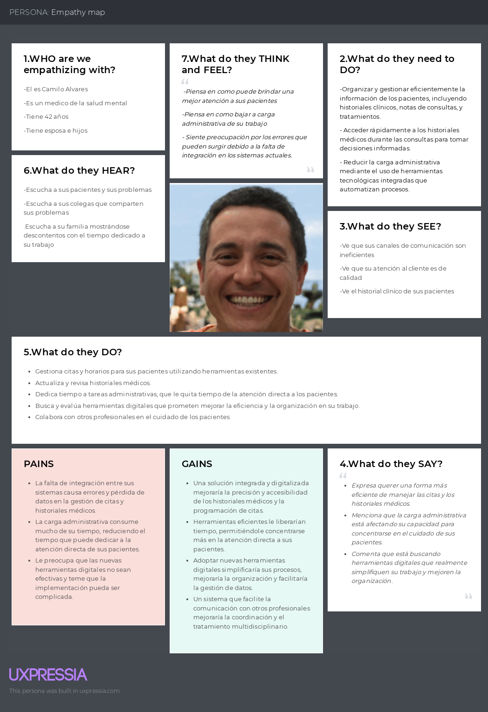
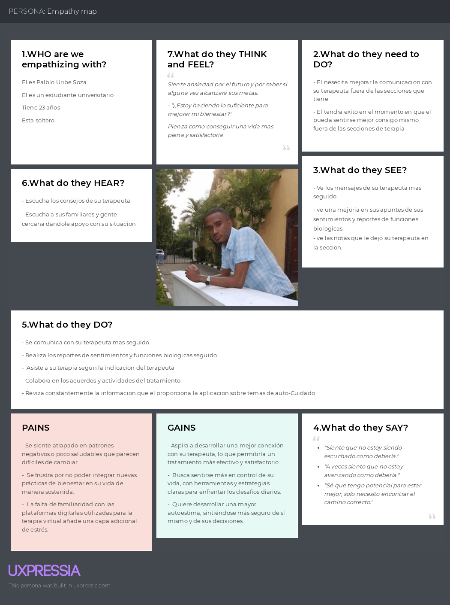

### Capítulo II: Requirements Elicitation & Analysis

## 2.1. Competidores
### 2.1.1. Análisis competitivo
### 2.1.2. Estrategias y tácticas frente a competidores

## 2.2. Entrevistas
### 2.2.1. Diseño de entrevistas
### 2.2.2. Registro de entrevistas
### 2.2.3. Análisis de entrevistas

## 2.3.Needfinding
### 2.3.1. User Personas
### 2.3.2. User Task Matrix
### 2.3.3. User Journey Mapping

### 2.3.4. Empathy Mapping
- **Segmento objetivo:** Profesionales de la salud mental:
  El Empathy Map de los profesionales de la salud mental de PsyMed busca 
comprender sus pensamientos, emociones, necesidades y frustraciones en 
torno a su labor diaria. Se enfoca en cómo experimentan la carga 
administrativa, el seguimiento clínico y la gestión del tiempo, 
revelando su deseo de ofrecer una atención más efectiva y centrada 
en el paciente. Este enfoque permite que PsyMed se diseñe como una 
herramienta que responda realmente a sus desafíos cotidianos, 
optimizando procesos y aliviando tensiones.

- **Segmento objetivo:** Pacientes de profesionales de la salud mental:
  El Empathy Map de los pacientes en PsyMed permite entender cómo viven 
su proceso de atención en salud mental, desde sus emociones hasta sus 
necesidades prácticas. Refleja su deseo de sentirse escuchados, 
acompañados y con un tratamiento claro y accesible. También revela 
frustraciones como la falta de seguimiento o el poco conocimiento sobre su 
propio progreso. Este enfoque ayuda a que PsyMed se adapte a sus 
experiencias, brindando un entorno más empático, organizado y seguro para
su bienestar emocional.

### 2.3.5. As-is Scenario Mapping