# Capítulo II: Requirements Elicitation & Analysis
## 2.1. Competidores
### 2.1.1 Análisis Competitivo

<table>
  <tr>
    <th colspan="22">Competitive Analysis Landscape</th>
  </tr>
  <tr>
    <td colspan="1">¿Por qué llevar a cabo el análisis?</td>
    <td colspan="17">El análisis competitivo es esencial para entender el mercado, identificar oportunidades que nos diferencien y anticipar amenazas. Permite ajustar la estrategia para ganar ventaja sobre la competencia y asegurar el éxito del producto.</td>
  </tr>
  <tr>
    <td colspan="2">(En la cabecera colocar por cada competidor nombre y logo)</td>
    <td>PsyMed </td>
    <td>TherapyNotes </td>
    <td>Teladoc 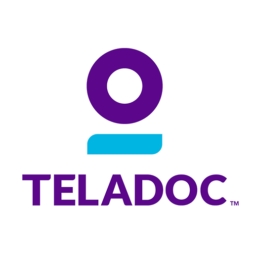</td>
    <td>Talkspace 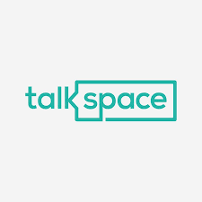</td>
</tr>
  <tr>
    <td rowspan="2">Perfil</td>
    <td>Overview</td>
    <td>PsyMed es una plataforma diseñada para centralizar la gestión de información de pacientes en instituciones de salud mental, mejorando la eficiencia operativa y facilitando la colaboración entre profesionales.</td>
    <td>TherapyNotes es una plataforma integral de gestión para profesionales de la salud mental, que facilita la programación de citas, la facturación y el almacenamiento seguro de información clínica en un solo lugar.</td>
    <td>Teladoc es una plataforma de telemedicina que ofrece servicios de salud mental, permitiendo a los pacientes acceder a consultas psiquiátricas y de terapia a través de citas en línea y videollamadas seguras.</td>
    <td>Talkspace proporciona terapia en línea principalmente a través de mensajes de texto, complementada con sesiones de video, manejando la administración de seguros y otras tareas para los terapeutas.</td>
</tr>
  <tr>
  <td>Ventaja competitiva ¿Qué valor ofrece a los clientes?</td>
    <td>Centraliza la información clínica, mejorando la eficiencia y colaboración en instituciones de salud mental.</td>
    <td>Simplifica la gestión terapéutica integrando citas, facturación y almacenamiento seguro, permitiendo a los profesionales centrarse en el paciente.</td>
    <td>Ofrece acceso conveniente a servicios de salud mental de alta calidad con cobertura de seguro desde cualquier lugar</td>
    <td>Facilita la terapia flexible mediante mensajes y video, manejando la administración para los terapeutas</td>
    </tr>
<tr>
    <td rowspan="2">Perfil de Marketing</td>
    <td>Mercado Objetivo</td>
    <td>Profesionales de salud mental que centralizan datos clínicos y pacientes que acceden a tratamientos y registros.</td>
    <td>Profesionales de salud mental que gestionan citas y registros clínicos.</td>
    <td>Pacientes que buscan consultas de salud mental en línea con seguro.</td>
    <td>Personas que prefieren terapia flexible por mensajes y video.</td>
  </tr>
  <tr>
  <td>Estrategias de Marketing</td>
    <td>Publicidad en línea, redes sociales, y alianzas con instituciones de salud mental.</td>
    <td>Publicidad en línea y en conferencias de salud mental.</td>
    <td>Publicidad en medios digitales y colaboraciones con aseguradoras.</td>
    <td>Publicidad en línea, redes sociales y campañas en medios de comunicación.</td>
    </tr>
<tr>
    <td rowspan="3">Perfil de Producto</td>
    <td>Productos y Servicios</td>
    <td>Proporciona una plataforma para instituciones de salud mental que centraliza la gestión de información clínica, permite la programación de citas, el seguimiento de tratamientos, y facilita la colaboración entre profesionales, además de ofrecer a los pacientes acceso seguro a sus datos y tratamientos.</td>
    <td>Ofrece una plataforma integral para la gestión de prácticas de salud mental, incluyendo programación de citas, facturación electrónica, almacenamiento seguro de registros clínicos, y un portal para pacientes, todo diseñado para optimizar la eficiencia operativa de los profesionales.</td>
    <td>Brinda servicios de telemedicina que incluyen consultas psiquiátricas y de terapia a través de videollamadas seguras, con integración de seguros y acceso desde cualquier lugar, facilitando el tratamiento continuo y conveniente para los pacientes.</td>
    <td>Facilita el acceso a terapia a través de una plataforma que permite sesiones de texto y video, con gestión automatizada de seguros y facturación, ofreciendo una solución flexible y accesible para quienes buscan apoyo mental sin desplazarse.</td>
  </tr>
  <tr>
  <td>Precios y Costos</td>
    <td>Planes de suscripción escalonados según el número de usuarios y servicios adicionales.</td>
    <td>Suscripción mensual con opciones de prueba gratuita.</td>
    <td>Pago por consulta, con opciones de cobertura de seguro.</td>
    <td>Planes semanales con opciones de servicios premium.</td>
    </tr>
<td>Canales de distribución (Web y/o Móvil)</td>
    <td>Sitio Web</td>
    <td>Sitio Web</td>
    <td>Sitio Web</td>
    <td>Sitio Web y móvil.</td>
<tr>
    <td rowspan="4">Análisis SWOT</td>
    <td>Fortalezas</td>
    <td>- Interfaz intuitiva diseñada específicamente para la gestión clínica en salud mental.  - Enfoque especializado en la centralización de datos clínicos para facilitar la colaboración entre profesionales.  - Potencial para integrarse con otras plataformas y servicios de salud.</td>
    <td>- Interfaz intuitiva y fácil de usar que integra múltiples funciones en una sola plataforma.  - Amplia base de usuarios en el sector de salud mental, con una fuerte reputación en la comunidad.  - Soporte robusto para la gestión de registros clínicos y la facturación electrónica, que mejora la eficiencia operativa de las prácticas terapéuticas.</td>
    <td>- Amplia red de profesionales certificados que ofrece servicios de salud mental a una gran variedad de pacientes.  - Integración con múltiples planes de seguro, lo que facilita el acceso a servicios de calidad.  - Conveniencia de acceso desde cualquier lugar, lo que maximiza la flexibilidad para los usuarios.</td>
    <td>- Flexibilidad para ofrecer terapia a través de mensajes de texto y video, lo que se adapta a las necesidades de los usuarios modernos.  - Simplificación de la administración para los terapeutas, incluyendo la gestión de seguros y facturación.  - Gran base de usuarios y fuerte presencia en el mercado de terapia en línea.</td>
  </tr>
  <tr>
  <td>Debilidades</td>
    <td>- Dependencia inicial de la adopción de usuarios en un mercado competitivo.  - Falta de historial probado dado que la plataforma está en una etapa temprana de desarrollo.  - Recursos limitados para el marketing y expansión inicial en comparación con competidores más establecidos.</td>
    <td>- Dependencia de suscripciones pagas, lo que podría limitar la adopción entre usuarios con menores recursos.  - Limitada flexibilidad para personalización fuera de las funciones estándar.  - Competencia de nuevas plataformas que ofrecen más integraciones o características a precios competitivos.</td>
    <td>- Dependencia de la calidad y disponibilidad de conexión a internet para realizar las consultas.  - Costos por consulta que pueden ser elevados sin cobertura de seguro, limitando el acceso para algunos pacientes.  - Posible percepción de despersonalización del servicio debido a la naturaleza digital de las consultas.</td>
    <td>- Dependencia en gran medida de la comunicación escrita, lo que podría no ser ideal para todos los tipos de terapia.  - Percepción de que el servicio puede ser menos personal comparado con las sesiones presenciales tradicionales.  - Tarifas que podrían ser prohibitivas para algunos usuarios sin cobertura de seguro.</td>
    </tr>
  <tr>
<td>Oportunidades</td>
    <td>- Expansión a instituciones de salud mental en diversas regiones.  - Desarrollo de asociaciones con universidades y centros de investigación en salud mental.  - Incorporación de funciones avanzadas como telemedicina y análisis predictivo de datos de salud mental.</td>
    <td>- Expansión internacional y adaptación a regulaciones de salud mental en diferentes países.  - Desarrollo de nuevas integraciones con otras plataformas de salud y herramientas de telemedicina.  - Incorporación de funciones de inteligencia artificial para mejorar la gestión de citas y la automatización de procesos clínicos.</td>
    <td>- Expansión a nuevos mercados internacionales con alta demanda de servicios de telemedicina.  - Integración con tecnologías emergentes, como wearables, para ofrecer servicios más personalizados.  - Alianzas estratégicas con organizaciones de salud para ampliar su base de usuarios.</td>
    <td>- EExpansión a nuevos mercados internacionales con alta demanda de terapia accesible y flexible.  - Desarrollo de nuevas funciones, como grupos de apoyo en línea y recursos educativos para mejorar la experiencia del usuario.  - Colaboración con grandes empleadores para ofrecer servicios de salud mental como parte de los beneficios laborales.</td>
</tr>
  <tr>
<td>Amenazas</td>
    <td>- Competencia de plataformas más consolidadas en el sector de la salud mental.  - Cambios regulatorios que afecten la gestión y privacidad de los datos clínicos.  - Desafíos en la adopción de tecnología por parte de instituciones de salud tradicionales que prefieren métodos convencionales.</td>
    <td>- Cambios regulatorios que podrían afectar la gestión de datos de salud.  - Creciente competencia de plataformas con ofertas más económicas o especializadas.  - Vulnerabilidad a ciberataques debido a la gran cantidad de información sensible que maneja.
</td>
    <td>- Competencia creciente de otras plataformas de telemedicina que ofrecen servicios similares a precios competitivos.  - Cambios en las regulaciones de telemedicina que podrían afectar la prestación de servicios en ciertos mercados.  - Riesgo de pérdida de confianza del paciente debido a posibles problemas de privacidad y seguridad de los datos.</td>
    <td>- Competencia de plataformas emergentes que ofrezcan servicios más personalizados o especializados.  - Cambios regulatorios que podrían impactar la capacidad de ofrecer terapia a través de medios digitales en ciertos mercados.  - Posibles problemas de seguridad y privacidad de los datos que podrían afectar la confianza de los usuarios.</td>
</tr>
</table>

### 2.1.2. Estrategias y tácticas frente a competidores.
Para fortalecer nuestra posición en el mercado, PsyMed se centrará en aprovechar sus fortalezas clave, como la centralización de la información clínica y la interfaz intuitiva,
que facilita la colaboración entre profesionales y ofrece un acceso seguro a los pacientes. Este enfoque nos permitirá diferenciar nuestra plataforma en un mercado competitivo, destacándonos como una solución integral para instituciones de salud mental. Además, buscaremos oportunidades de expansión mediante alianzas con universidades y centros de investigación, lo que no solo mejorará nuestras capacidades tecnológicas, sino que también nos posicionará como un líder en innovación dentro del sector.

En cuanto a nuestras debilidades, como la falta de historial comprobado y recursos limitados en esta etapa inicial, adoptaremos una estrategia gradual, que incluirá implementaciones piloto en instituciones clave.
Esto nos permitirá demostrar el valor de PsyMed, mitigar riesgos y construir una base sólida de confianza con nuestros primeros usuarios antes de una expansión a mayor escala.

Simultáneamente, abordaremos las amenazas del mercado y los posibles cambios regulatorios mediante prácticas rigurosas de cumplimiento y actualizaciones constantes en nuestras políticas de seguridad.
Lo que reforzará la confianza de nuestros clientes y nos permitirá competir eficazmente frente a otras plataformas establecidas.

# 2.2 Entrevistas
### 2.2.1. Diseño de entrevistas.

**Preguntas para el segmento de profesionales de la salud mental:**

- **Preguntas Objetivas:**
  - ¿Cuál es el navegador que más utilizas?
  - ¿Ha pagado por herramientas que le ayuden a hacer un seguimiento de sus pacientes en el pasado? ¿Cuáles y por qué?
  - Actualmente, ¿Cómo manejas la información de tus pacientes?
  - ¿Qué tipo de información no se puede revelar a los pacientes y cuál sí está permitido?
  - ¿Qué precio mensual o anual considerarías razonable para un servicio como este?
      
- **Preguntas Subjetivas:**
  - ¿Qué tan familiarizado está con el uso de plataformas digitales?
  - ¿Cuál es el perfil de pacientes que usted atiende?
  - ¿Qué dificultades tienes al atender a tus pacientes?
  - ¿Qué factores determinan que un paciente busque ayuda psicológica y cuál es la diferencia con el manejo con un profesional de salud mental?
  - ¿Cómo se lleva a cabo la evaluación de un paciente nuevo?
  - ¿Cómo se determina un diagnóstico y cuánto tiempo toma?
  - ¿Cómo se decide el plan de tratamiento para un paciente?
  - ¿Qué tan importante es hacer un seguimiento del paciente?
  - ¿Qué funciones crees que la plataforma deba tener además de las mencionadas?

**Preguntas para el segmento de pacientes:**

- **Preguntas Objetivas:**
  - ¿Cuál es el navegador que más utilizas?
  - ¿Qué herramienta usas más seguido? Tablets, celulares, laptops, smartwatch, etc.
  - ¿Qué tan seguido interactúas con tu terapeuta,o tu profesional de salud mental? (Sesiones, chats, llamadas, etc.)
  - ¿Has utilizado alguna vez una plataforma digital para gestionar tus citas o tratamientos médicos? Si es así, ¿cómo fue tu experiencia? ¿Qué aspectos te resultaron más útiles o frustrantes?
  - ¿Te sentirías cómodo utilizando una plataforma digital para interactuar con tu profesional de la salud mental?
  - ¿Qué información te gustaría tener visible en la plataforma? Por ejemplo, citas, recordatorios de medicamentos, notas de las sesiones, etc.
  - ¿Te gustaría poder comunicarte con tu profesional de salud mental a través de la plataforma? ¿Qué tipo de comunicación preferirías (mensajes, videollamadas, etc.)?
      
- **Preguntas Subjetivas:**
  - ¿Estás familiarizado con las plataformas digitales?
  - ¿Cuándo y por qué motivo decidiste buscar ayuda profesional para tu salud mental?
  - ¿Tienes alguna preocupación en cuanto a la privacidad y seguridad de tu información personal al usar una plataforma digital? ¿Qué te haría sentir más seguro al usarla?

### 2.2.2. Registro de entrevistas.

**Segmento 1: Profesionales de la salud mental:**

Entrevistado 1:

  

| Nombre               | Lucia                                                                                                                                                                                                                                                                                                                                  |
|----------------------|---------------------------------------------------------------------------------------------------------------------------------------------------------------------------------------------------------------------------------------------------------------------------------------------------------------------------------------|
| Apellido             | Cruz                                                                                                                                                                                                                                                                                                                                  |
| Edad                 | 30                                                                                                                                                                                                                                                                                                                                  |                                                                                                                                                                                                                                                                                                                     |
| URL                  | [[Entrevista_Médicos_01](https://upcedupe-my.sharepoint.com/:v:/g/personal/u202213468_upc_edu_pe/Ee7CIOQMlkxJhj-bC7_g3N0Bs9_gFqaSF9CBj9IS1hkSGQ?e=1CWcrr&nav=eyJyZWZlcnJhbEluZm8iOnsicmVmZXJyYWxBcHAiOiJTdHJlYW1XZWJBcHAiLCJyZWZlcnJhbFZpZXciOiJTaGFyZURpYWxvZy1MaW5rIiwicmVmZXJyYWxBcHBQbGF0Zm9ybSI6IldlYiIsInJlZmVycmFsTW9kZSI6InZpZXcifX0%3D)) |
| Inicio de entrevista | 0:47 minutos                                                                                                                                                                                                                                                                                                                          |
| Fin de entrevista    | 17:00 minutos                                                                                                                                                                                                                                                                                                                         |

**Resumen:**

La Dra. Cruz utiliza plataformas digitales con regularidad para su organización personal y profesional (Google Drive, Excel, Word), pero no ha pagado por herramientas específicas para el seguimiento de pacientes debido a razones económicas. 
Actualmente maneja la información en carpetas digitales por paciente, usando archivos de Word y Excel para registrar datos clínicos.
Destacó algunas dificultades como las eprogramaciones de citas por parte de los pacientes y la atención emocional en momentos críticos fuera de la sesión.
Por otro lado, mencionó el valor en que esta tecnología genere un historial útil para futuras sesiones y mencionó algunas funcionalidades para la plataforma como:

- Notificaciones para que el paciente recuerde su medicación o tareas.
- Registro y consulta de horarios para el paciente.
- Integración con herramientas ya usadas por el terapeuta (como Google Calendar).
- Registro post-sesión por parte del terapeuta para evaluar el progreso.

Entrevistado 2:

  

| Nombre               | Guisela                                                                                                                                                                                                                                                                                                                                |
|----------------------|---------------------------------------------------------------------------------------------------------------------------------------------------------------------------------------------------------------------------------------------------------------------------------------------------------------------------------------|
| Apellido             | Rios                                                                                                                                                                                                                                                                                                                               |
| Edad                 | 21                                                                                                                                                                                                                                                                                                                               |                                                                                                                                                                                                                                                                                                                     |
| URL                  | [[Entrevista_Médicos_02](https://upcedupe-my.sharepoint.com/:v:/g/personal/u202213468_upc_edu_pe/EZlUAesf9pBLgNNwOav42tYBcdK0Vvh96LhtucYRzdgDIA?e=CBi7zf&nav=eyJyZWZlcnJhbEluZm8iOnsicmVmZXJyYWxBcHAiOiJTdHJlYW1XZWJBcHAiLCJyZWZlcnJhbFZpZXciOiJTaGFyZURpYWxvZy1MaW5rIiwicmVmZXJyYWxBcHBQbGF0Zm9ybSI6IldlYiIsInJlZmVycmFsTW9kZSI6InZpZXcifX0%3D)) |
| Inicio de entrevista | 0:46 minutos                                                                                                                                                                                                                                                                                                                          |
| Fin de entrevista    | 15:47 minutos    

**Resumen:**
Ella menciona tener experiencia en el uso de plataformas como Atlas.ti y MAXQDA, las cuales ha utilizado durante la elaboración de su tesis, destacando que ambas requieren pago en dólares.
Actualmente, gestiona la información de sus pacientes utilizando Excel, debido a su accesibilidad y comprensión por parte de otros profesionales en su entorno. Su familiaridad con herramientas digitales es alta, ya que domina redes sociales y aplicaciones como WhatsApp. Durante la entrevista, la psicóloga planteó funciones que consideraría útiles para una plataforma de gestión psicológica como por ejemplo:

- Información sistematizada y bien estructurada, permitiendo una lectura rápida y comprensible.
- Un entorno de navegación intuitiva, similar a plataformas digitales actuales, para facilitar el uso diario.
- Un enfoque especial en la calidad de redacción, ya que considera importante que los textos estén bien redactados como parte de la experiencia profesional y personal.

Entrevistado 3:

  

| Nombre               | Sara                                                                                                                                                                                                                                                                                                                                |
|----------------------|---------------------------------------------------------------------------------------------------------------------------------------------------------------------------------------------------------------------------------------------------------------------------------------------------------------------------------------|
| Apellido             | Silva                                                                                                                                                                                                                                                                                                                               |
| Edad                 | 29                                                                                                                                                                                                                                                                                                                               |                                                                                                                                                                                                                                                                                                                     |
| URL                  | [[Entrevista_Médicos_03](https://upcedupe-my.sharepoint.com/:v:/g/personal/u202213468_upc_edu_pe/EUURykWREgBElIYSI5tfNXAB3mcyxryr6ybI-2AkYTIQjg?e=xFMY47&nav=eyJyZWZlcnJhbEluZm8iOnsicmVmZXJyYWxBcHAiOiJTdHJlYW1XZWJBcHAiLCJyZWZlcnJhbFZpZXciOiJTaGFyZURpYWxvZy1MaW5rIiwicmVmZXJyYWxBcHBQbGF0Zm9ybSI6IldlYiIsInJlZmVycmFsTW9kZSI6InZpZXcifX0%3D)) |
| Inicio de entrevista | 0:00 minutos                                                                                                                                                                                                                                                                                                                          |
| Fin de entrevista    | 00:00 minutos    

**Resumen:**
Sara menciona que no ha utilizado plataformas pagadas para la gestión de pacientes, optando por herramientas accesibles como Excel, que le permiten organizar la información de los estudiantes con diagnósticos como autismo o síndrome de Down. Esta base de datos es compartida entre el equipo de psicología de la institución educativa donde trabaja. También usa archivadores físicos para complementar la organización de la información. Durante la entrevista, la psicóloga planteó funciones que consideraría útiles para una plataforma de gestión psicológica, tales como:

- Agenda compartida entre profesionales (psicólogo escolar y terapeutas externos) para facilitar la coordinación de reuniones.
- Recordatorios automáticos para padres, terapeutas o psicólogos sobre próximas reuniones, citas o tareas pendientes.
- Registro sistematizado de estudiantes con historial clínico, diagnósticos y plan de intervención, accesible de forma rápida y clara.
- Plataforma que permita organizar y almacenar información tanto escolar, familiar como terapéutica en un solo lugar.

#### Segmento 2: Pacientes

Entrevistado 1:

    

| Nombre               | Uriel                                                                                                                                                                                                                                                                                                                                  |
|----------------------|---------------------------------------------------------------------------------------------------------------------------------------------------------------------------------------------------------------------------------------------------------------------------------------------------------------------------------------|
| Apellido             | Ortiz                                                                                                                                                                                                                                                                                                                                  |
| Edad                 | 19                                                                                                                                                                                                                                                                                                                                  |                                                                                                                                                                                                                                                                                                                     |
| URL                  | [[Entrevista_Pacientes_01](https://upcedupe-my.sharepoint.com/:v:/g/personal/u202213468_upc_edu_pe/EUKtxlhQ7-dBh33-zVOWM2kBZs0o0xMGovuiFYQ38gnyOA?e=JJh2NW&nav=eyJyZWZlcnJhbEluZm8iOnsicmVmZXJyYWxBcHAiOiJTdHJlYW1XZWJBcHAiLCJyZWZlcnJhbFZpZXciOiJTaGFyZURpYWxvZy1MaW5rIiwicmVmZXJyYWxBcHBQbGF0Zm9ybSI6IldlYiIsInJlZmVycmFsTW9kZSI6InZpZXcifX0%3D)) |
| Inicio de entrevista | 00:20 minutos                                                                                                                                                                                                                                                                                                                          |
| Fin de entrevista    | 03:00 minutos  

**Resumen:**

El entrevistado ha usado herramientas como el calendario integrado del dispositivo para gestionar citas, aunque considera frustrante la cantidad de pasos requeridos para configurar eventos (frecuencia, hora, fecha, etc.).
Se mostró abierto a usar una plataforma digital para su tratamiento de salud mental, siempre y cuando esta integre diversos servicios útiles y relevantes.
No tiene preocupaciones sobre la privacidad de su información en la plataforma, pero sí le incomodan los comentarios o juicios que puedan existir entre profesionales. Finalmente agregó algunas ideas al proyecto:

- Visualización de citas y recordatorios de sesiones.
- Recordatorios de medicación (por ejemplo: “Tomar medicación los martes, sesión los viernes”).
- Comunicación con el profesional, prefiriendo mensajes en una primera interacción por ser más discretos y adaptables al día a día.
- Interés en que la plataforma centralice diversos servicios relacionados con la salud mental.

Entrevistado 2:

    

| Nombre               | Luigi                                                                                                                                                                                                                                                                                                                                 |
|----------------------|---------------------------------------------------------------------------------------------------------------------------------------------------------------------------------------------------------------------------------------------------------------------------------------------------------------------------------------|
| Apellido             | Paccini                                                                                                                                                                                                                                                                                                                                 |
| Edad                 | 19                                                                                                                                                                                                                                                                                                                                  |                                                                                                                                                                                                                                                                                                                     |
| URL                  | [[Entrevista_Pacientes_02](https://upcedupe-my.sharepoint.com/:v:/g/personal/u202213468_upc_edu_pe/EUX0WaUe-ypKnHtPX8OgxcABCJp-B7CXTTMiSNl-0VMlkw?e=5I8tad&nav=eyJyZWZlcnJhbEluZm8iOnsicmVmZXJyYWxBcHAiOiJTdHJlYW1XZWJBcHAiLCJyZWZlcnJhbFZpZXciOiJTaGFyZURpYWxvZy1MaW5rIiwicmVmZXJyYWxBcHBQbGF0Zm9ybSI6IldlYiIsInJlZmVycmFsTW9kZSI6InZpZXcifX0%3D)) |
| Inicio de entrevista | 00:56 minutos                                                                                                                                                                                                                                                                                                                          |
| Fin de entrevista    | 04:30 minutos  

**Resumen:**

El entrevistado mencionó que usa principalmente el teléfono móvil por su practicidad, y suele interactuar con su profesional de salud mental cada seis meses, mayormente en sesiones presenciales.
No ha utilizado plataformas digitales para gestionar sus citas o tratamientos médicos hasta ahora, aunque estaría abierto a hacerlo si la herramienta facilita el proceso y evita desplazamientos innecesarios.
Se sentiría cómodo utilizando una plataforma digital para interactuar con su profesional, siempre que sea sencilla de usar. 
Mostró especial interés en poder realizar sesiones virtuales, valorando la comodidad de no tener que asistir físicamente.

- Notas de sesiones, para recordar los temas tratados y visualizar su progreso.
- Sesiones por videollamada, al considerarlas más personales y cercanas que los mensajes de texto.
- Privacidad de la información, asegurando que solo su profesional tenga acceso a sus datos personales.

Entrevistado 3:

    

| Nombre               | Guillermo                                                                                                                                                                                                                                                                                                                                |
|----------------------|---------------------------------------------------------------------------------------------------------------------------------------------------------------------------------------------------------------------------------------------------------------------------------------------------------------------------------------|
| Apellido             | Alfaro                                                                                                                                                                                                                                                                                                                               |
| Edad                 | 20                                                                                                                                                                                                                                                                                                                                  |                                                                                                                                                                                                                                                                                                                     |
| URL                  | [[Entrevista_Pacientes_03](https://upcedupe-my.sharepoint.com/:v:/g/personal/u202213468_upc_edu_pe/EdXyEYcsILpJoC6bjVXEPz4B91_om4RgYbfb7N8vV_cPbQ?e=WNTJ6B&nav=eyJyZWZlcnJhbEluZm8iOnsicmVmZXJyYWxBcHAiOiJTdHJlYW1XZWJBcHAiLCJyZWZlcnJhbFZpZXciOiJTaGFyZURpYWxvZy1MaW5rIiwicmVmZXJyYWxBcHBQbGF0Zm9ybSI6IldlYiIsInJlZmVycmFsTW9kZSI6InZpZXcifX0%3D)) |
| Inicio de entrevista | 00:32 minutos                                                                                                                                                                                                                                                                                                                          |
| Fin de entrevista    | 04:16 minutos  

**Resumen:**

El entrevistado indicó que utiliza con más frecuencia el celular y la laptop para sus actividades diarias. 
Mencionó que suele interactuar con su profesional de salud mental dos veces por semana, principalmente en sesiones presenciales.
Respecto al uso de plataformas digitales para gestionar su tratamiento, indicó que solo ha utilizado herramientas básicas como la agenda y alarmas del teléfono, 
las cuales le han resultado útiles para recordar citas, aunque algo limitadas y agobiantes por depender exclusivamente de ellas.
Se mostró abierto a usar una plataforma digital, destacando que le brindaría mayor accesibilidad y flexibilidad. 
Entre las funcionalidades que le gustaría tener visibles en la plataforma están:

- Registro de sesiones y notas.
- Recordatorios de medicamentos
- Información sobre qué medicamentos necesita y dónde conseguirlos.
- Seguimiento del tratamiento.

### 2.2.3 Análisis de entrevistas

Se procede a recopilar las estadísticas de las respuestas de los
entrevistados para representarlas mediante gráficos proporcionados
por la herramienta, Google Forms.

- **Segmento 1: Profesionales de Salud Mental de la salud mental  **

Según los datos recolectados para el análisis de nuestro segmento de profesionales de la salud, se ha identificado que una mayoría significativa se encuentra en el rango de edad entre 18 y 30 años, con un nivel educativo universitario o técnico en curso.
En términos de género, hay una ligera mayoría femenina, y un pequeño de los entrevistados reside fuera de Lima Metropolitana, aunque la mayoría cuenta con acceso a servicios digitales.

  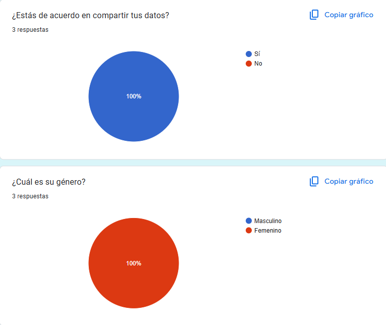
  
  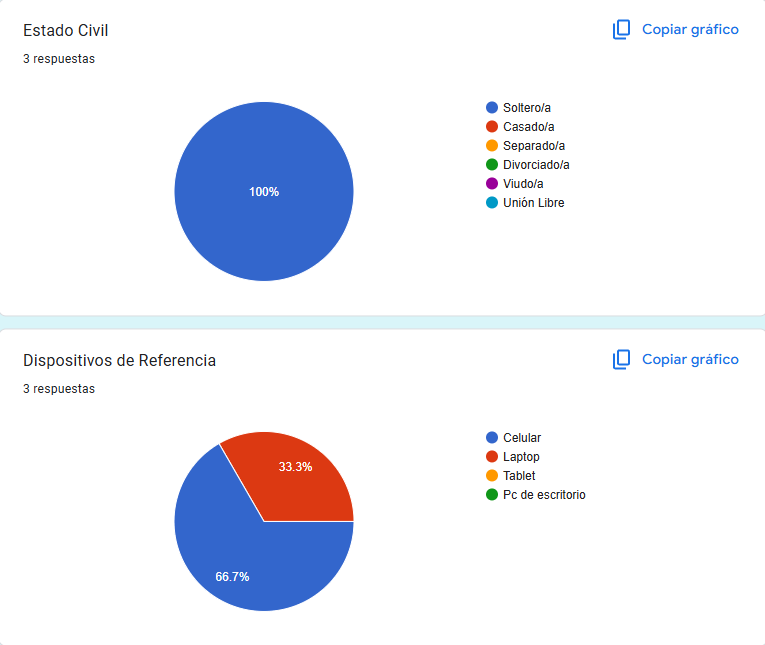

- **Segmento 2: Pacientes**

Según los datos recolectados para el análisis de nuestro segmento de pacientes, se ha identificado que una mayoría significativa se encuentra en el rango de edad entre 18 y 30 años, con un nivel educativo universitario o técnico en curso.
En términos de género, hay una ligera mayoría masculina, y la mayoría de los entrevistados reside fuera de Lima Metropolitana, aunque la mayoría cuenta con acceso a servicios digitales.

  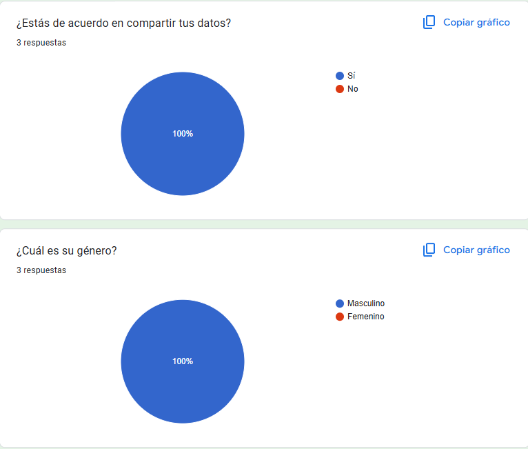
  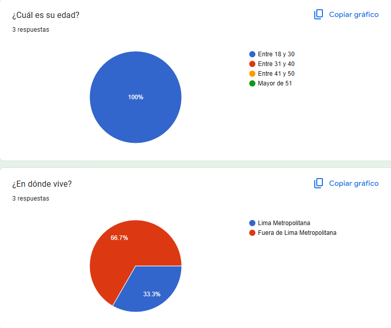
  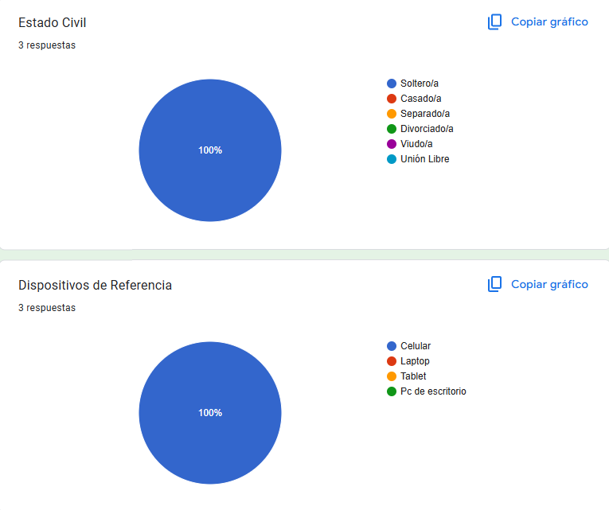

## 2.3 Needfinding:
Tras llevar a cabo las entrevistas, reunimos información relevante acerca de sus aspiraciones, dificultades, contexto y otros aspectos importantes que nos ayudarán a comprender mejor sus necesidades y optimizar la experiencia de nuestros usuarios. Además, estos datos servirán de base para construir los esquemas de User Personas, User Task Matrix, User Journey Maps y Empathy Mapping.

### 2.3.1 User Persona:
En el proceso de creación de un sitio web destinado a mejorar la calidad laboral de los médicos en el área de salud mental, hemos detectado que optimizar la gestión administrativa es fundamental para ofrecer una mejor atención a los pacientes. Mediante entrevistas a usuarios potenciales y especialistas, recopilamos información valiosa sobre cómo una plataforma virtual puede reducir la carga administrativa, permitiendo que los médicos se concentren más en el cuidado de sus pacientes.

Las fichas de User Persona que presentaremos a continuación reflejan estas necesidades, destacando cómo una administración más ágil puede beneficiar tanto la experiencia del médico como el bienestar del paciente. Estas herramientas serán clave para diseñar una plataforma que se alinee con las expectativas de nuestros usuarios.

**Segmento Objetivo: Profecional mental**
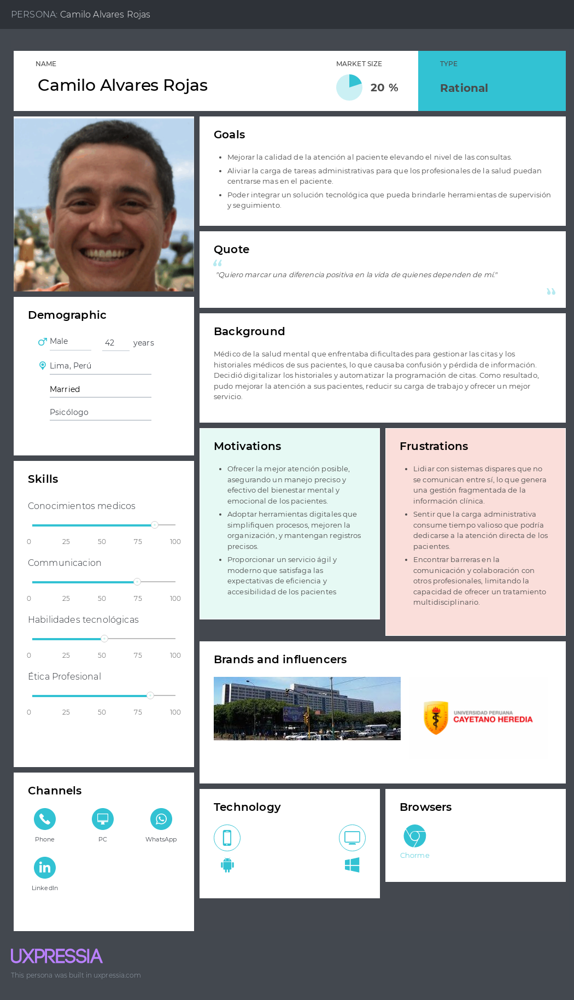
**Segmento Objetivo: Paciente**
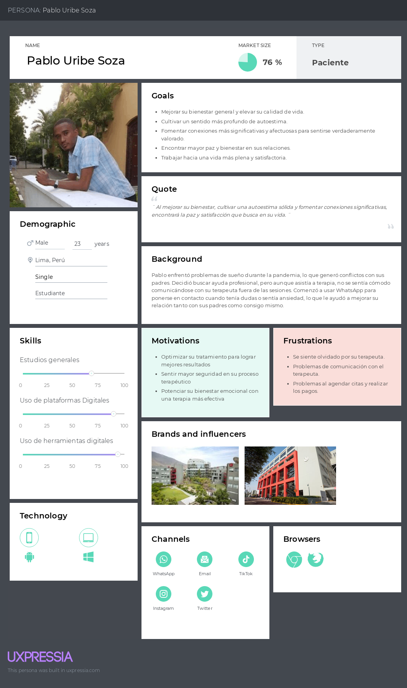

## User Task Matrix
En esta sección se presenta el **User Task Matrix**, que concentra las tareas que los User Persona (que representan a cada segmento) realizan para cumplir sus objetivos. No se deben confundir tareas (tasks) con opciones o características de software, pues las tareas deben ser realizadas por los segmentos independientemente de la existencia de la solución de software.

| Tareas                                                | Médicos de la salud mental/ Importancia | Médicos de la salud mental/ Frecuencia | Pacientes/ Importancia                 | Pacientes/ Frecuencia                  |
|-------------------------------------------------------|----------------------------------------|----------------------------------------|----------------------------------------|----------------------------------------|
| Gestión y actualización de historias clínicas         | Alta                                   | Siempre                                | -                                      | -                                      |
| Programación y gestión de citas                       | Alta                                   | Siempre                                | Alta                                   | A veces                                |
| Registro de notas de sesiones                         | Alta                                   | Siempre                                | -                                      | -                                      |
| Acceso a la información médica relevante              | Alta                                   | Siempre                                | -                                      | -                                      |
| Revisión de tratamientos y planes terapéuticos        | Alta                                   | A veces                                | -                                      | -                                      |
| Generación de reportes clínicos                       | Media                                  | A veces                                | -                                      | -                                      |
| Coordinación de reuniones de equipo multidisciplinario| Media                                  | Nunca                                  | -                                      | -                                      |
| Agendar y gestionar citas                             | -                                      | -                                      | Alta                                   | A veces                                |
| Acceso a información sobre tratamientos               | -                                      | -                                      | Alta                                   | A veces                                |
| Seguimiento de citas y recordatorios                  | -                                      | -                                      | Alta                                   | Siempre                                |
| Acceso a sus propios registros clínicos               | -                                      | -                                      | Media                                  | A veces                                |
| Participación en encuestas de seguimiento de salud    | -                                      | -                                      | Media                                  | Nunca                                  |

### Análisis de la Matriz

En la matriz presentada, se pueden observar las siguientes tareas con mayor frecuencia e importancia:

- **Médicos de la salud mental**:
    - La gestión y actualización de historias clínicas, la programación y gestión de citas, el registro de notas de sesiones, y el acceso a la información médica relevante se destacan por su alta importancia y su frecuencia "Siempre", ya que son esenciales para el desempeño diario de los profesionales.
    - La generación de reportes clínicos y la coordinación de reuniones de equipo multidisciplinario, aunque importantes, tienen una frecuencia menor, ya que estas tareas no son realizadas de manera continua.

- **Pacientes**:
    - Las tareas de agendar y gestionar citas, el seguimiento de citas y recordatorios, y la comunicación con el médico, aunque de alta importancia, varían en frecuencia, con algunas realizadas "Siempre" y otras "A veces".
    - Otras tareas, como la participación en encuestas de seguimiento de salud y la revisión de facturas y pagos, tienen una frecuencia "Nunca", lo que refleja su menor impacto en el día a día de los pacientes.

Las coincidencias entre los segmentos destacan la importancia de una solución integrada que facilite la gestión tanto para médicos como para pacientes. Las principales diferencias se reflejan en la naturaleza de las tareas, donde los médicos tienen un enfoque más administrativo y clínico, mientras que los pacientes se centran en la gestión personal de su atención médica.

## User Journey Mapping

El User Journey Mapping se desarrolló para comprender la experiencia de los usuarios al interactuar con nuestra plataforma. Este mapeo detalla cada paso que el usuario realiza, los obstáculos que puede encontrar, y las emociones que surgen en el proceso. Así, nos ayuda a identificar oportunidades para mejorar la usabilidad y satisfacción del usuario.

### Segmento 1: Profesionales de Salud Mental de la salud mental
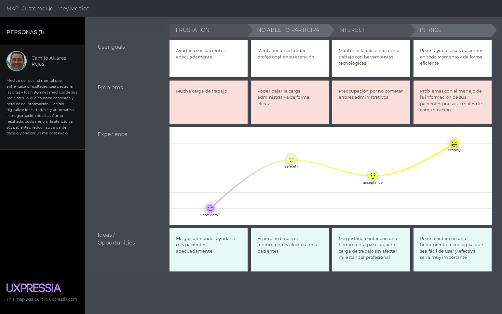
### Segmento 2: Paciente
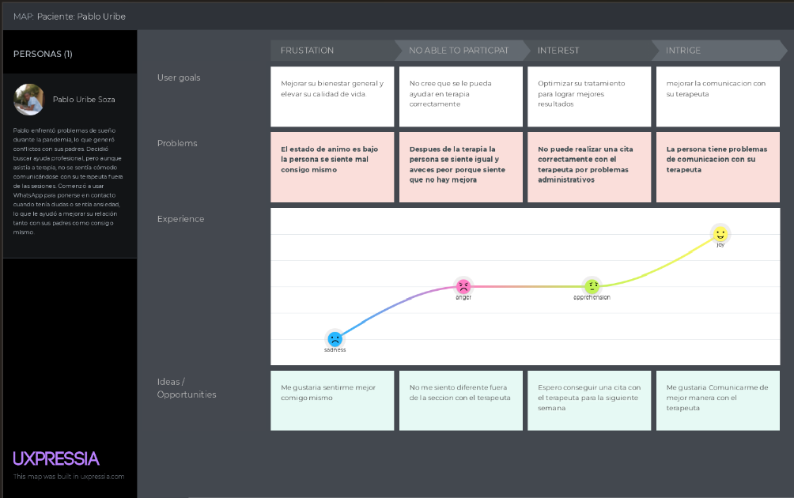

## 2.3.4. Emphaty Mapping

Para desarrollar el Empathy Map, hemos basado nuestra información en los datos recopilados de nuestros dos User Personas, quienes representan a nuestro público objetivo. Este mapa nos ofrece una visión más profunda de las necesidades, pensamientos, emociones y acciones de los usuarios, lo que nos permite crear soluciones más ajustadas a sus expectativas y vivencias reales.

### Segmento 1: Psicologo

  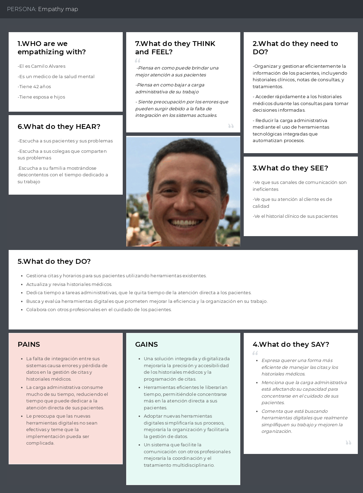

### Segmento 2: Pacientes

  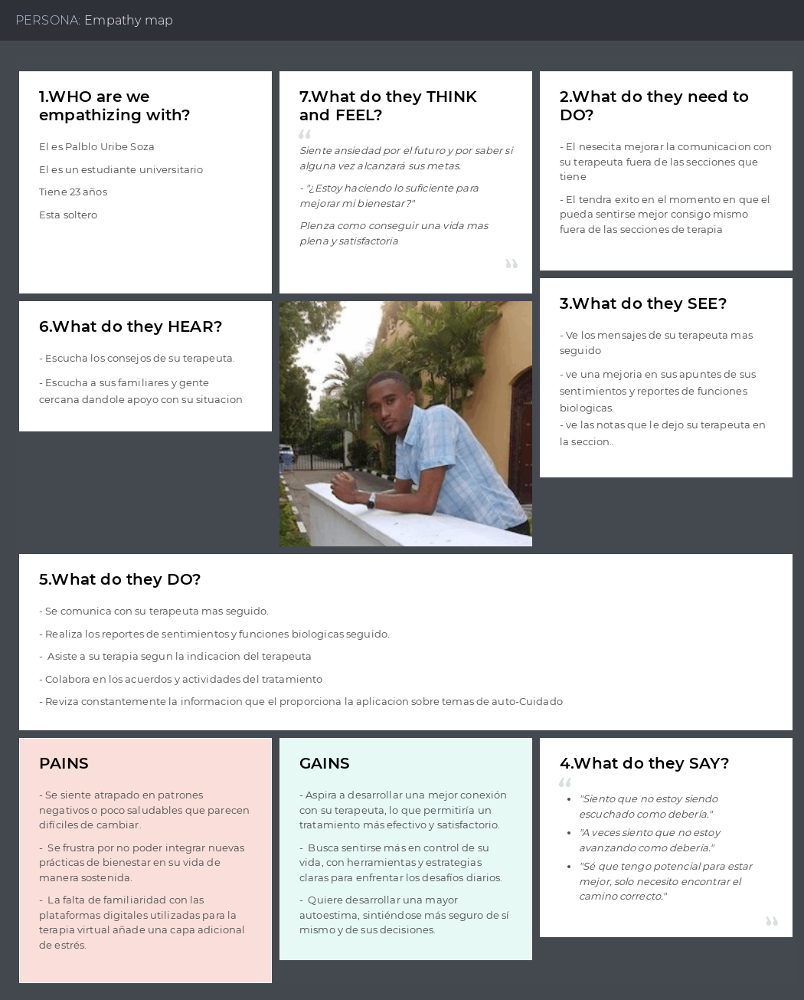

## 2.3.5 As-is Scenario Mapping
- **Segmento objetivo:** Psicologo

  

- **Segmento objetivo:** Pacientes

  

## 2.4. Ubiquitous Language
- User Profile (Perfil del Usuario): Información básica del paciente o profesional de la salud mental, como datos personales, preferencias de notificación y detalles de contacto. Puede incluir también datos de acceso para la plataforma.

- Treatment Plan (Plan de Tratamiento): Conjunto de recomendaciones, terapias o intervenciones diseñadas por el profesional de la salud mental para ayudar al paciente a mejorar su bienestar, basándose en el diagnóstico y las sesiones previas.

- Patient (Paciente): Persona que recibe atención profesional en salud mental y cuya evolución es monitoreada a través de la plataforma. El paciente puede registrar su estado emocional y diversos aspectos de su bienestar físico.

- Psychologist: Persona encargada de la gestión y seguimiento de uno o varios pacientes. Este profesional puede registrar y actualizar información clínica, citas, medicamentos, y realizar un seguimiento del progreso del paciente.

- Dashboard (Panel de Control): Interfaz donde el psicólogo puede visualizar información clave de los pacientes, tales como citas futuras, estado de sus funciones biológicas y próximos seguimientos programados.

- Session (Sesión): Interacción entre el profesional de la salud mental y el paciente. Cada sesión puede generar notas, diagnósticos y actualizaciones en el historial clínico del paciente.

- Medical History (Historial Clínico): Registro detallado de toda la información médica del paciente, que incluye diagnósticos previos, tratamientos recibidos y antecedentes relevantes.

- Diagnosis (Diagnóstico): Evaluación médica realizada por el profesional de la salud mental basada en las sesiones y en el historial clínico del paciente.

- Medication (Medicamento): Tratamiento prescrito al paciente por el profesional de la salud mental. El estado de los medicamentos puede ser monitoreado y ajustado a lo largo del tiempo.

- Biological Functions (Funciones Biológicas): Parámetros físicos del paciente, como el sueño, el apetito, la energía y otros aspectos relacionados con su bienestar físico, que se registran de manera diaria en la plataforma para un monitoreo constante.

- Emotional State (Estado Emocional): Se monitorea el estado emocional diario del paciente en base a una escala.

