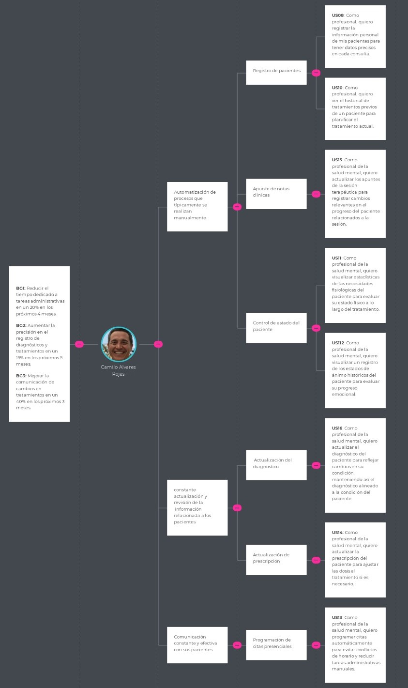
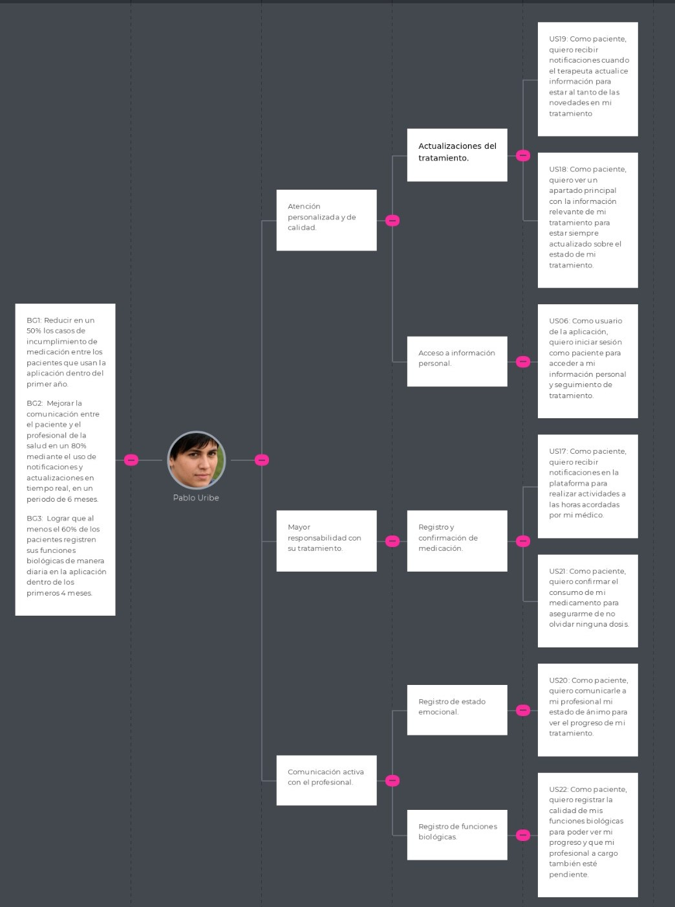

# **CAPÍTULO III: REQUIREMENTS SPECIFICATIONS**

## 3.3. Impact Mapping

**Impact mapping del segmento objetivo: Psicologo**

  

**Impact mapping del segmento objetivo: Pacientes**

  

## 3.4. Product Backlog
| Orden | User Story / Technical Story Id | Título                                                                                              | Descripción                                                                                                                                                                                                                                                                              | Story Points (1 / 2 / 3 / 5 / 8)   |
| 1     | US03                            | Presentación visual de imágenes y gráficos relevantes                                               | **Como** usuario que visita la Landing Page, **deseo** que las imágenes y gráficos sean nítidos y visualmente atractivos **para** captar mi atención y entender mejor el contenido.                                                                                                      | 1                                  |
| 2     | US04                            | Tipografía clara y agradable a la vista                                                             | **Como** usuario que visita la Landing Page, **deseo** que la tipografía de la página sea fácil de leer y visualmente agradable **para** hacer más cómoda la lectura y navegación.                                                                                                       | 1                                  |
| 3     | US02                            | Localizar información sobre el propósito de la aplicación                                           | **Como** usuario que visita la Landing Page, **deseo** encontrar de manera sencilla la información que explique la finalidad de la aplicación **para** entender cómo puede beneficiarme.                                                                                                 | 2                                  |
| 4     | US20                            | Registro de emociones o estado de ánimo                                                             | **Como** paciente, **deseo** compartir mi estado de ánimo con mi profesional de salud **para** poder llevar un seguimiento del progreso de mi tratamiento.                                                                                                                               | 2                                  |
| 5     | US22                            | Registro de indicadores biológicos                                                                  | **Como** paciente, **deseo** registrar el estado de mis funciones biológicas **para** hacer un seguimiento de mi progreso y permitir que mi profesional de salud también esté informado.                                                                                                 | 2                                  |
| 6     | US23                            | Modificación de datos de acceso del paciente                                                        | **Como** psicologo, **deseo** actualizar los datos de acceso del paciente **para** asegurarme de que su información siempre esté correcta y actualizada según sea necesario.                                                                                                             | 2                                  |
| 7     | US24                            | Actualización de información personal del psicologo                                                 | **Como** psicologo, **deseo** actualizar mi información personal **para** mantener mis datos profesionales correctos y reflejar cualquier cambio importante.                                                                                                                             | 2                                  |
| 8     | US06                            | Ingreso al sistema como paciente                                                                    | **Como** paciente, **deseo** acceder a la plataforma **para** revisar mi información personal y hacer seguimiento de mi tratamiento.                                                                                                                                                     | 3                                  |
| 9     | US07                            | Ingreso al sistema como profesional de la salud mental                                              | **Como** psicologo, **deseo** acceder a la plataforma **para** gestionar la información de mis pacientes y tener acceso a herramientas de seguimiento.                                                                                                                                   | 3                                  |
| 10    | US08                            | Registro de datos personales del paciente                                                           | **Como** psicologo, **deseo** registrar los datos personales del paciente **para** tener un registro detallado y exacto de sus datos básicos en cada consulta.                                                                                                                           | 3                                  |
| 11    | US09                            | Registro de medicamentos del paciente                                                               | **Como** psicologo, **quiero** registrar los medicamentos del paciente **para** seguir adecuadamente su tratamiento farmacológico.                                                                                                                                                       | 3                                  |
| 12    | US10                            | Registro de historial previo del paciente                                                           | **Como** psicologo, **quiero** registrar el historial médico previo del paciente **para** tener un contexto completo de sus antecedentes.                                                                                                                                                | 3                                  |
| 13    | US11                            | Visualizar datos estadísticos de funciones biológicas                                               | **Como** psicologo, **quiero** visualizar estadísticas de las necesidades fisiológicas del paciente **para** evaluar su estado físico a lo largo del tratamiento.                                                                                                                        | 3                                  |
| 14    | US12                            | Visualización de los estados de ánimo del paciente                                                  | **Como**psicologo, **quiero** visualizar un registro de los estados de ánimo históricos del paciente **para** evaluar su progreso emocional.                                                                                                                                             | 3                                  |
| 15    | US13                            | Visualizar información del consumo de medicamentos del paciente                                     | **Como** psicologo, **quiero** visualizar registros del cumplimiento del paciente con el consumo de la medicación asignada **para** asegurarse de que este sigue el tratamiento correctamente.                                                                                           | 3                                  |
| 16    | US14                            | Actualizar ingesta de pastillas                                                                     | **Como** psicologo, **quiero** actualizar la prescripción del paciente **para** ajustar las dosis al tratamiento si es necesario.                                                                                                                                                        | 3                                  |
| 17    | US15                            | Actualizar apuntes de la sesión terapéutica                                                         | **Como** psicologo, **quiero** actualizar los apuntes de la sesión terapéutica **para** registrar cambios relevantes en el progreso del paciente relacionados a la sesión.                                                                                                               | 3                                  |
| 18    | US21                            | Inicio de sesión como pacientes                                                                     | **Como** paciente, **quiero**  iniciar sesión en la plataforma **para** acceder a mi información personal y seguimiento de tratamiento.                                                                                                                                                  | 3                                  |
| 19    | TS03                            | Eliminar paciente a través de un RESTful API                                                        | **Como** desarrollador, **quiero**  implementar la funcionalidad para eliminar un paciente a través de una API RESTful, **para** gestionar correctamente la eliminación de registros de pacientes según sea necesario.                                                                   | 3                                  |
| 20    | TS04                            | Eliminar profesional de la salud mental a través de un RESTful API                                  | **Como** desarrollador, **quiero**  implementar la funcionalidad para eliminar un psicologo a través de una API RESTful,**para** que el sistema pueda gestionar correctamente la eliminación de registros de profesionales según sea necesario.                                          | 3                                  |
| 21    | TS07                            | Añadir medicamentos de un paciente a través de un RESTful API                                       | **Como** desarrollador, **quiero**  implementar la opción para añadir medicamentos prescritos a un paciente a través de una API RESTful, **para** que la medicación del paciente quede registrada y pueda ser consultada y actualizada según sea necesario.                              | 3                                  |
| 22    | TS08                            | Recuperar datos estadísticos de funciones biológicas del paciente a través de un RESTful API        | **Como** desarrollador, **quiero**  implementar la opción de recuperar datos estadísticos de funciones biológicas del paciente a través de una API RESTful, de manera que esta información pueda ser almacenada y analizada **para** el monitoreo de la salud del paciente.              | 3                                  |
| 23    | TS09                            | Recuperar datos del estado de ánimo del paciente a través de un RESTful API                         | **Como** desarrollador, **quiero**  implementar la opción para recuperar datos del estado de ánimo del paciente a través de una API RESTful, de manera que esta información pueda ser utilizada **para** el seguimiento y tratamiento del paciente.                                      | 3                                  |
| 24    | TS10                            | Recuperar datos de consumo de medicamentos válidos                                                  | **Como** desarrollador, **quiero**  implementar la opción de recuperar datos del consumo de medicamentos del paciente a través de una API RESTful, **para** que se pueda hacer seguimiento al cumplimiento del tratamiento por parte del paciente.                                       | 3                                  |
| 25    | TS12                            | Actualizar apuntes de la sesión terapéutica a través de un RESTful API                              | **Como** desarrollador, **quiero**  implementar la opción de actualizar los apuntes de una sesión terapéutica a través de una API RESTful, **para** que el profesional de salud mental pueda mantener los registros de la sesión actualizados.                                           | 3                                  |
| 26    | TS13                            | Añadir apuntes de la sesión terapéutica a través de un RESTful API                                  | **Como** desarrollador, **quiero**  implementar la funcionalidad para añadir apuntes de una sesión terapéutica a través de una API RESTful, **para** que el profesional de salud mental pueda registrar información relevante sobre la sesión y el progreso del paciente.                | 3                                  |
| 27    | TS16                            | Obtener recordatorio de actividades a través de un RESTful API                                      | **Como** desarrollador, **quiero**  implementar la opción para obtener el recordatorio de actividades a través de una API RESTful, **para** que los pacientes puedan visualizar sus próximos compromisos o tareas asignadas.                                                             | 3                                  |
| 28    | TS18                            | Obtener notificación cuando el terapeuta agregue o modifique información a través de un RESTful API | **Como** desarrollador, **quiero**  implementar la opción de obtener notificaciones cuando el terapeuta agregue o modifique información a través de una API RESTful, **para** que el paciente o los sistemas conectados puedan estar al tanto de actualizaciones importantes.            | 3                                  |
| 29    | TS20                            | Registro de confirmación de consumo de pastillas a través de un RESTful API                         | **Como** desarrollador, **quiero**  implementar la opción de registrar la confirmación del consumo de pastillas a través de una API RESTful, **para** que se pueda hacer un seguimiento del cumplimiento del tratamiento por parte del paciente.                                         | 3                                  |
| 30    | TS21                            | Registro de funciones biológicas a través de un RESTful API                                         | **Como** desarrollador, **quiero**  implementar la opción de registrar las funciones biológicas del paciente a través de una API RESTful, de manera que estos datos puedan ser almacenados **para** monitoreo y análisis clínico.                                                        | 3                                  |
| 31    | US03                            | Acceso a Soporte Técnico                                                                            | **Como** visitante de la Landing Page, **quiero** tener fácil acceso a soporte técnico **para** resolver cualquier duda o problema relacionado con la aplicación.                                                                                                                        | 3                                  |
| 32    | US12                            | Recuperación de Contraseña Sencilla                                                                 | **Como** usuario de la aplicación, **quiero** tener un proceso sencillo para recuperar mi contraseña **para** poder acceder nuevamente en caso de olvidarla.                                                                                                                             | 3                                  |
| 33    | US27                            | Revisión de Actualizaciones en la Terapia                                                           | **Como** profesional de la salud mental, **quiero** poder revisar las actualizaciones previas en el tratamiento **para** entender el historial de cambios y su impacto.                                                                                                                  | 3                                  |
| 34    | US31                            | Notificación de Nuevos Mensajes del Terapeuta                                                       | **Como** paciente, **quiero** recibir notificaciones inmediatas cuando mi terapeuta me envíe un nuevo mensaje **para** estar al tanto de cualquier cambio o recomendación en mi tratamiento.                                                                                             | 3                                  |
| 35    | US32                            | Acceso a Nuevas Instrucciones de Tratamiento                                                        | **Como** paciente, **quiero** poder acceder fácilmente a nuevas instrucciones de tratamiento enviadas por mi terapeuta **para** asegurarme de seguir el plan correctamente.                                                                                                              | 3                                  |
| 36    | US37                            | Revisión de Progreso Diario                                                                         | **Como** paciente, **quiero** revisar mi progreso diario en el tratamiento **para** mantenerme motivado y enfocado en mis objetivos terapéuticos.                                                                                                                                        | 3                                  |
| 37    | US40                            | Cambio de Contraseña por Seguridad                                                                  | **Como** usuario, **quiero** poder cambiar mi contraseña periódicamente **para** mantener mi cuenta segura.                                                                                                                                                                              | 3                                  |
| 38    | US06                            | Diseño Atractivo                                                                                    | **Como** visitante de la Landing Page, **quiero** que el diseño de la página sea moderno y atractivo **para** que me invite a explorar más sobre la aplicación.                                                                                                                          | 5                                  |
| 39    | US07                            | Interactividad en la Navegación                                                                     | **Como** visitante de la Landing Page, **quiero** que la navegación sea interactiva y fluida **para** tener una experiencia de usuario positiva mientras exploro la aplicación.                                                                                                          | 5                                  |
| 40    | US17                            | Actualización de Información del Paciente                                                           | **Como** profesional de la salud mental, **quiero** poder actualizar la información del paciente de manera rápida y sencilla **para** mantener su historial al día.                                                                                                                      | 5                                  |
| 41    | US21                            | Visualización de Progreso en el Tratamiento                                                         | **Como** profesional de la salud mental, **quiero** visualizar el progreso del tratamiento del paciente en un solo lugar **para** hacer un seguimiento eficaz.                                                                                                                           | 5                                  |
| 42    | US26                            | Registro de Cambios en la Terapia                                                                   | **Como** profesional de la salud mental, **quiero** registrar cualquier cambio realizado en la terapia del paciente **para** tener un seguimiento detallado de su evolución.                                                                                                             | 5                                  |
| 43    | US36                            | Registro Diario de Actividades Terapéuticas                                                         | **Como** paciente, **quiero** registrar diariamente mis actividades terapéuticas **para** que mi terapeuta pueda hacer un seguimiento continuo de mi progreso.                                                                                                                           | 5                                  |
| 44    | US01                            | Adaptabilidad y compatibilidad de la Landing Page                                                   | **Como** visitante de la Landing Page, **quiero**  que el contenido se adapte al tamaño de la pantalla del dispositivo desde el que accede **para** obtener la información de manera ordenada.                                                                                           | 5                                  |
| 45    | US05                            | Registro como profesional de la salud mental                                                        | **Como** psicologo **quiero**  registrarme con mis credenciales **para** poder acceder a las funcionalidades específicas y gestionar la información de mis pacientes.                                                                                                                    | 5                                  |
| 46    | US16                            | Actualizar diagnóstico del paciente                                                                 | **Como** psicologol, **quiero**  actualizar el diagnóstico del paciente **para** reflejar cambios en su condición, manteniendo así el diagnóstico alineado a la condición del paciente.                                                                                                  | 5                                  |
| 47    | US17                            | Recibir notificaciones de recordatorios de actividades                                              | **Como** paciente, **quiero**  recibir notificaciones en la plataforma **para** realizar actividades a las horas acordadas por mi médico.                                                                                                                                                | 5                                  |
| 48    | US18                            | Visualizar cambios en el dashboard                                                                  | **Como** paciente, **quiero**  visualizar un apartado principal con la información relevante de mi tratamiento **para** estar siempre actualizado sobre el estado de mi tratamiento.                                                                                                     | 5                                  |
| 49    | US19                            | Recibir notificaciones cuando el terapeuta agregue o modifique información                          | **Como** paciente, **quiero**  recibir notificaciones cuando el terapeuta actualice información **para** estar al tanto de las novedades en mi tratamiento.                                                                                                                              | 5                                  |
| 50    | TS06                            | Añadir historial médico del paciente a través de un RESTful API                                     | **Como** desarrollador, **quiero**  implementar la opción para añadir un historial previo del paciente a través de una API RESTful, **para** que el sistema pueda almacenar y gestionar la información clínica anterior del paciente para su consulta y análisis posterior.              | 5                                  |
| 51    | TS11                            | Actualizar información de consumo de pastillas del paciente a través de un RESTful API              | **Como** desarrollador, **quiero**  implementar la opción de actualizar los apuntes de una sesión terapéutica a través de una API RESTful, **para** que el profesional de salud mental pueda mantener los registros de la sesión actualizados.                                           | 5                                  |
| 52    | TS14                            | Actualizar diagnóstico del paciente a través de un RESTful API                                      | **Como** desarrollador, **quiero**  implementar la opción de actualizar el diagnóstico del paciente a través de una API RESTful, **para** que el profesional de salud mental pueda modificar y mantener actualizado el diagnóstico del paciente en el sistema.                           | 5                                  |
| 54    | TS17                            | Obtener datos del dashboard a través de un RESTful API                                              | **Como** desarrollador, **quiero**  implementar la opción de obtener los datos del dashboard del paciente a través de una API RESTful, de manera que se pueda visualizar información resumida y relevante **para** el seguimiento de su estado de salud y progreso.                      | 5                                  |
| 55    | TS19                            | Registro de estado de ánimo del paciente a través de un RESTful API                                 | **Como** desarrollador, **quiero**  implementar la opción de registrar el estado de ánimo del paciente a través de una API RESTful, **para** que la información del estado emocional del paciente sea almacenada y esté disponible para su análisis y seguimiento.                       | 5                                  |
| 56    | TS22                            | Actualización de datos de acceso de un paciente a través de un RESTful API                          | **Como** desarrollador, **quiero**  implementar la opción de actualizar los datos de acceso de un paciente a través de una API RESTful, de manera que el paciente pueda modificar sus credenciales **para** mejorar la seguridad.                                                        | 5                                  |
| 57    | TS23                            | Actualización de información del profesional de salud mental a través de un RESTful API             | **Como** desarrollador, **quiero**  implementar la opción de actualizar la información del profesional de salud mental a través de una API RESTful, de manera que los datos del profesional (como la especialidad o los datos de contacto) puedan mantenerse actualizados en el sistema. | 5                                  |
| 58    | TS01                            | Añadir paciente a través de un RESTful API                                                          | **Como** desarrollador, **quiero**  que se pueda añadir a un paciente a través de un API, **para** que el profesional de salud mental registre al paciente.                                                                                                                              | 8                                  |
| 59    | TS02                            | Añadir profesional de la salud mental a través de un RESTful API                                    | **Como** desarrollador, **quiero**  implementar la opción de añadir un profesional de la salud mental a través de una API RESTful, **para** que este pueda interactuar con los pacientes en el sistema.                                                                                  | 8                                  |
| 60    | TS05                            | Inicio de sesión a través de un RESTful API                                                         | **Como** desarrollador, **quiero**  implementar la funcionalidad para el inicio de sesión a través de una API RESTful, **para** que los usuarios puedan autenticarse y acceder a las funcionalidades del sistema de manera segura.                                                       | 8                                  |
| 61    | US11                            | Inicio de Sesión con Autenticación de Dos Factores                                                  | **Como** usuario de la aplicación, **quiero** que el inicio de sesión incluya una autenticación de dos factores **para** garantizar la seguridad de mi cuenta.                                                                                                                           | 8                                  |
| 62    | US16                            | Registro Completo de Información Médica                                                             | **Como** psicologo, **quiero** registrar toda la información médica relevante de mis pacientes **para** tener un historial completo para su tratamiento.                                                                                                                                 | 8                                  |
| 63    | US22                            | Notificación de Desviaciones en el Tratamiento                                                      | **Como** psicologo, **quiero** recibir notificaciones si el paciente no sigue el tratamiento adecuadamente **para** intervenir si es necesario.                                                                                                                                          | 8                                  |