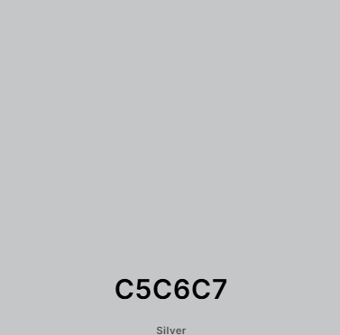
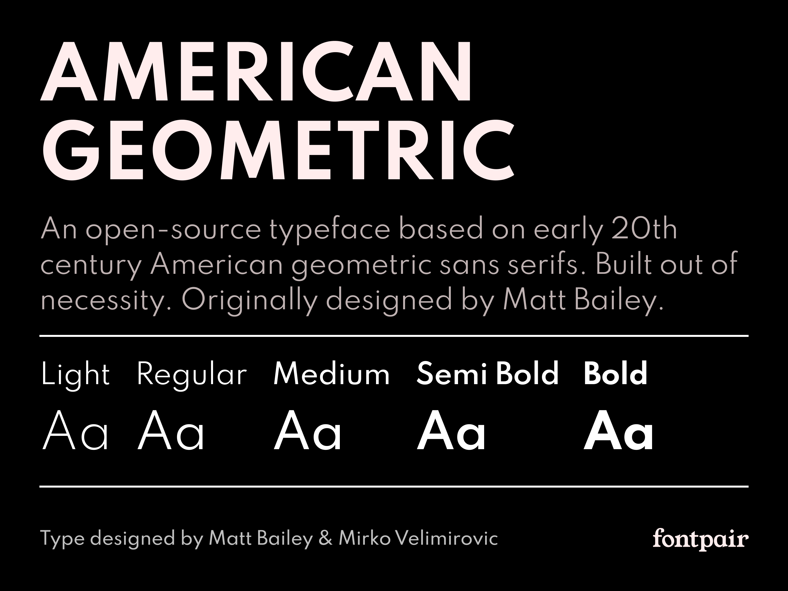

# **CAPÍTULO IV: PRODUCT DESIGN**
## 4.1. Style Guidelines
En esta sección, presentaremos el concepto de diseño para la página web y la aplicación, de modo que nuestros usuarios tengan una interfaz amigable y funcional. 
Con este propósito, hemos optado por utilizar elementos visuales que sean amigables y atractivos a la vista.

### 4.1.1. General Style Guidelines
Nuestra paleta de colores se ha seleccionado para proporcionar un entorno digital que apoye la salud mental y el bienestar, 
tanto para los psiquiatras como para sus pacientes. Buscamos en la plataforma un espacio donde la confianza, 
la claridad y la seguridad sean primordiales, asegurando que la interacción entre profesionales y pacientes sea efectiva. 
Este enfoque se refleja en la selección de colores, que buscan transmitir calma, confiabilidad y profesionalismo. A continuación, se presenta una breve descripción de los colores que se utilizarán en nuestra aplicación:

#### Chromatic Colors

**#10BEAE (Verde Vitalidad – Principal):**  
Este verde vibrante es el color principal para gran parte de nuestro proyecto. Inspira renovación y energía positiva, reflejando la vitalidad y el bienestar que Psymed busca promover en sus usuarios. 
Este tono se utiliza para destacar elementos clave e inspirar confianza a lo largo de la experiencia del usuario.

  

**#4A90E2 (Azul Serenidad – Secundario):**  
Un azul suave que transmite serenidad, profesionalismo y claridad. Refuerza el sentido de confianza entre paciente y especialista, y se utiliza en botones secundarios, enlaces y componentes informativos de la interfaz.

  

**#A29BFE (Lavanda Empática – Apoyo):**  
Este tono lavanda ofrece un matiz emocional que promueve la calma y la empatía. Es ideal para elementos decorativos o indicadores de progreso, brindando suavidad visual sin restar legibilidad o protagonismo a los elementos principales.

  

**#7ED6A8 (Verde Tranquilo – Acento):**  
Complementario al color principal, este verde más claro añade equilibrio visual a la interfaz. Se utiliza como color de acento para reforzar mensajes positivos, estados satisfactorios o validaciones.

  

#### Achromatic Colors

**#F5F7FA (Blanco Niebla – Fondo):**  
Un gris muy claro que funciona como fondo base para toda la interfaz. Birndando limpieza y neutralidad, permitiendo que los colores cromáticos resalten sin provocar fatiga visual.

  

**#4A4A4A (Gris Profundo – Texto):**  
Ideal para textos principales, este gris oscuro ofrece un alto contraste sin la dureza del negro puro. Favorece la legibilidad, especialmente en bloques largos de texto.

  

**#C5C6C7 (Gris Neutro – Separadores):**  
Usado para divisores, bordes sutiles y elementos secundarios, este tono ayuda a estructurar visualmente la interfaz sin añadir ruido visual.

  

**Typography: Sans Serif**

Para el proyecto Psymed, utilizaremos una fuente sans serif, que asegura una lectura clara y moderna. Dentro de esta categoría, emplearemos las variaciones de DM Sans y Spartan, ambas conocidas por su simplicidad y elegancia, ideales para mantener una estética limpia y profesional en todos los elementos textuales del sistema.

- **DM Sans - Sans Serif**

  

- **Spartan - Sans Serif**

  

**Icon:**

  

El ícono de **Psymed** representa el perfil de una persona visto de lado, con un cerebro esquemático en su interior y una cruz médica integrada.
Esta combinación transmite de forma clara el objetivo de nuestra plataforma: la salud mental, la atención especializada y el enfoque humano del tratamiento.

  

La silueta del perfil simboliza el enfoque personalizado hacia cada paciente. 
El cerebro representa el núcleo de nuestro trabajo: el bienestar cognitivo y emocional. La cruz, inspirada en el símbolo universal de la salud y refuerza nuestro compromiso con la atención médica confiable y profesional.

### 4.1.2. Web Style Guidelines

Las guías de estilo web de **Psymed** han sido desarrolladas con el objetivo de ofrecer una experiencia óptima y coherente en todos los dispositivos. 
Nuestra plataforma está diseñada bajo los principios del **Web Responsive Design**, lo que garantiza que cada elemento de la interfaz se adapte fluidamente a distintos tamaños de pantalla, desde teléfonos móviles hasta monitores de escritorio.

Uno de los pilares visuales de nuestra interfaz es la implementación del **patrón de diseño en forma de Z**, el cual guía de manera intuitiva la mirada del usuario a lo largo de la página. 
Este flujo comienza en la esquina superior izquierda, atraviesa el contenido principal y finaliza en la esquina inferior derecha. 

Este recorrido natural permite que la navegación sea clara y eficiente, facilitando el acceso a información clave como diagnósticos, citas médicas y seguimientos de síntomas.
El diseño adaptable y el uso estratégico del patrón en Z aseguran que, sin importar el dispositivo utilizado, la experiencia de usuario sea constante y centrada en las necesidades de los profesionales como de los pacientes. 
Estas directrices no solo definen la estética de **Psymed**, sino que también refuerzan nuestro compromiso con un entorno digital accesible, humano y orientado al bienestar mental.
