# Capítulo V: Product Implementation, Validation & Deployment.
## 5.1. Software Configuration Management.

Esta guía define las decisiones y acuerdos fundamentales para el desarrollo, mantenimiento y despliegue de la aplicación **PsyMed**, que gestiona el alquiler de vehículos. El objetivo es asegurar la coherencia, eficiencia y calidad a lo largo del ciclo de vida del proyecto.

### 5.1.1. Software Development Environment Configuration.

<table border="1">

  <tr>
    <td>Project Management</td>
    <td>Microsoft 365 Alojamiento de los videos de entrevistas, explicación de prototipos y otros relacionados al proyecto</td>
  </tr>
  <tr>
    <td></td>
    <td>Whatsapp Red Social destinada a la comunicación donde se realizaron acuerdos y recordatorios de las reuniones.</td>
  </tr>
  <tr>
    <td></td>
    <td>Trello Software de administración y gestión de proyectos que se utilizó para establecer y designar las tareas</td>
  </tr>
  <tr>
    <td>Requirements Management</td>
    <td>Structurizr Structurizr es una herramienta de modelado y documentación que permitió el desarrollo de los diagramas C4</td>
  </tr>
  <tr>
    <td></td>
    <td>LucidChart Herramienta de diseño para el modelado de diagramas UML.</td>
  </tr>
  <tr>
    <td></td>
    <td>Miro Herramienta de diseño para la creación de los As-Is y To-Be Scenario Mapping</td>
  </tr>
  <tr>
    <td>Product UX/UI Design</td>
    <td>Figma Herramienta que se utilizó para la creación de wireframes, mockups y prototipos.</td>
  </tr>
  <tr>
    <td>Software Development</td>
    <td>Git Es un software de control de versiones para los trabajos en equipos y confiabilidad del desarrollo.</td>
  </tr>
  <tr>
    <td></td>
    <td>Node.js Node.js es un entorno de ejecución de JavaScript del lado del servidor, que permite desarrollar aplicaciones web escalables y de alto rendimiento fuera del navegador.</td>
  </tr>
  <tr>
    <td></td>
    <td>GitHub Sistema de control de versiones Git.</td>
  </tr>
  <tr>
    <td></td>
    <td>HTML5 Lenguaje de etiquetas, utilizado para la estructuración y la presentación de contenido.</td>
  </tr>
  <tr>
    <td></td>
    <td>CSS CSS es un lenguaje utilizado para estilizar y dar formato a documentos HTML.</td>
  </tr>
  <tr>
    <td></td>
    <td>JavaScript JavaScript es un lenguaje de programación de alto nivel, interpretado y multi-paradigma, utilizado para crear interactividad en páginas web.</td>
  </tr>
  <tr>
    <td></td>
    <td>VScode Es un editor de código fuente con extensiones que ayudan al desarrollo.</td>
  </tr>
    <tr>
    <td></td>
    <td>WebStorm Es un IDE centrado en el desarrollo frontend, por su variedad de herramientas que agilizan el proceso de desarrollo.</td>
  </tr>
  <tr>
    <td></td>
    <td>Vue.js Framework Framework basado en Single Page Applications para el desarrollo de frontend</td>
  </tr>
  <tr>
    <td>Software Deployment</td>
    <td>GitHub Pages Plataforma que nos permite realizar el despliegue de nuestro landing page.</td>
  </tr>
</table>

### 5.1.2. Source Code Management.

Para el desarrollo del producto, utilizamos Gitflow para la organización de las ramas con los puntos a desarrollar durante el proyecto.
Para los repositorios se utilizó GitHub, para llevar un registro de los cambios realizados en las tareas asignadas siendo en este caso un repositorio para Report y otro para la Landing Page desplegada.

- URL del repositorio Report en GitHub: https://github.com/1ASI0729-2510-4317-G2-OpenGG/ReportFinalProject
- URL del repositorio Landing Page en GitHub: https://github.com/1ASI0729-2510-4317-G2-OpenGG/Landing-Page

### 5.1.3. Source Code Style Guide & Conventions

Para "**PsyMed**", implementaremos una guía de estilo de código y convenciones utilizando HTML y CSS, buscando implementar una interfaz sencilla e interactica.

**HTML**: Lenguaje que hemos utilizado para el desarrollo de nuestra Landing Page. Este lenguaje utiliza etiquetas para marcar y definir el contenido de la página web. Como textos, imagenes, videos, etc.

Convenciones:

- Se tiene que declarar el tipo de archivo en la primera fila de cada documento ("Doctype HTML o Styles CSS").
- Las etiquetas deben de mostrarse en minuscula, ya que es más sencillo identificar y por ende, será más sencillo detectar los contenidos para los desarrolladores.

**CSS**: Lenguaje que se vincula a un proyecto, en este caso, proyecyto html, que nos permite dar estilos a los elementos html. Con este lenguaje se pueden crear diseños web agradables e intuitivos para el usuario, que es lo que buscamos lograr en nuestra Landing Page.

### 5.1.4. Software Deployment Configuration.

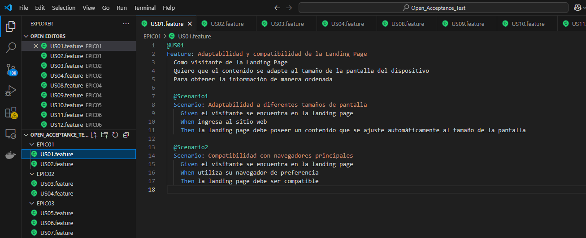

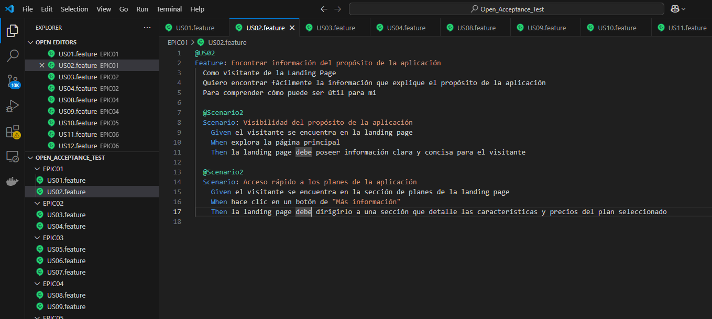

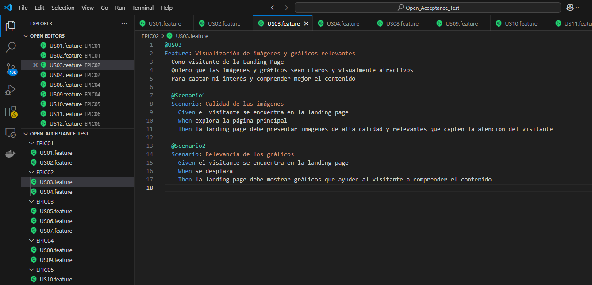

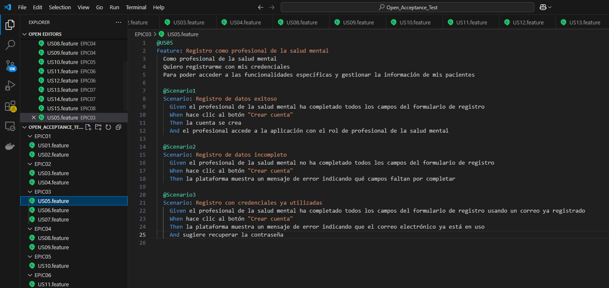

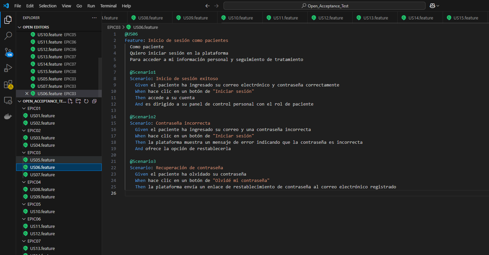

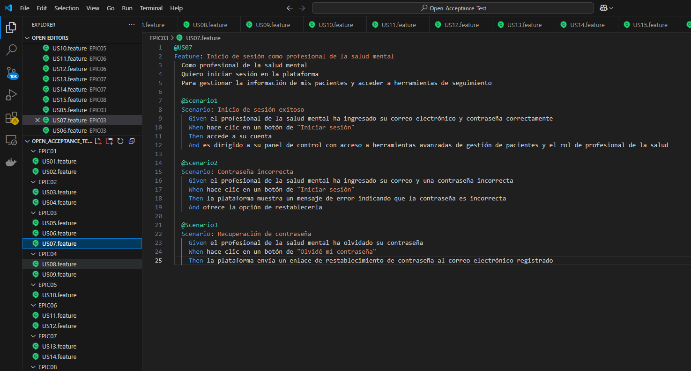

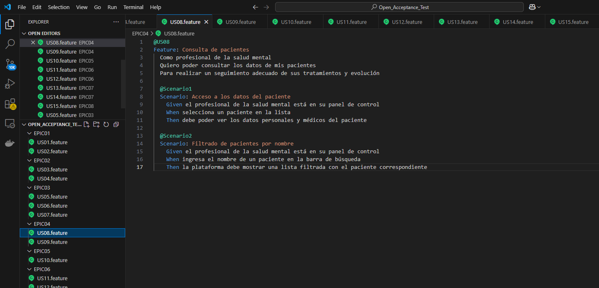

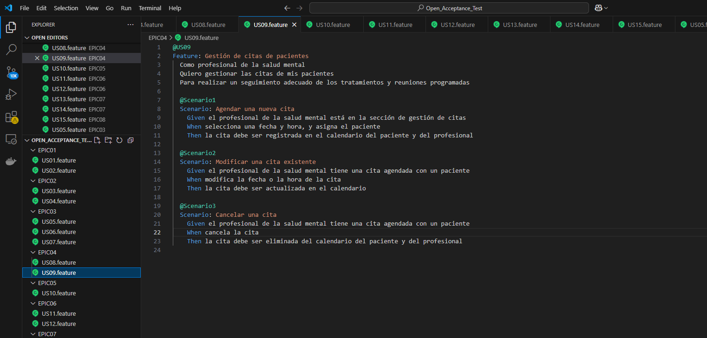

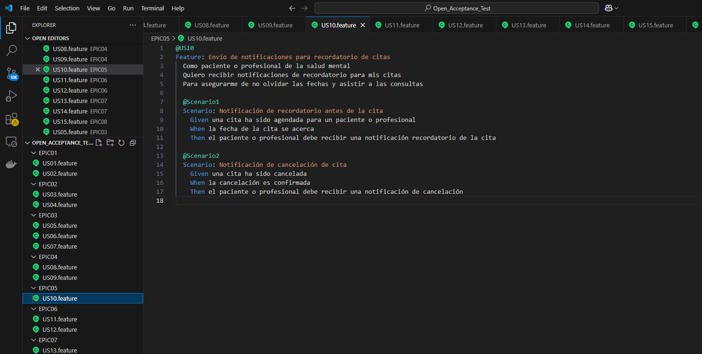

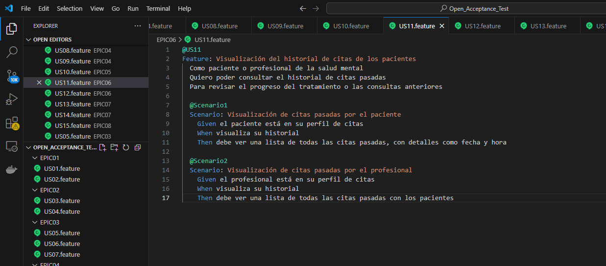

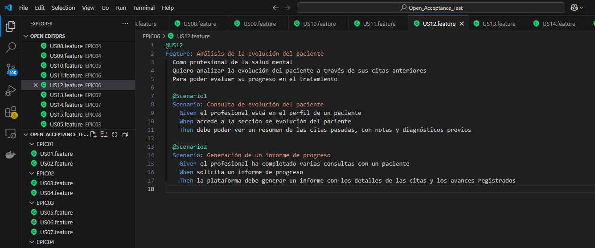

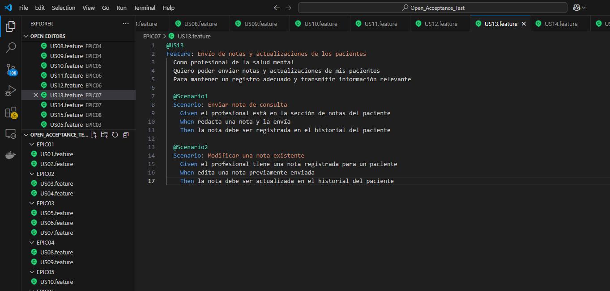

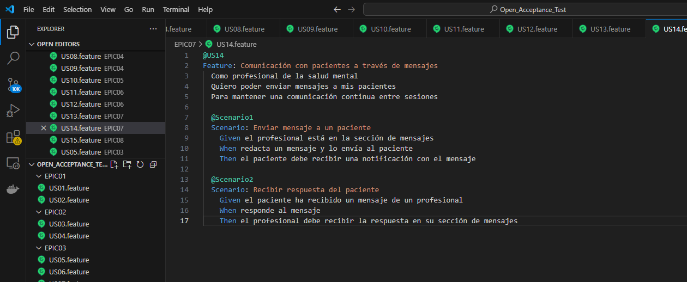

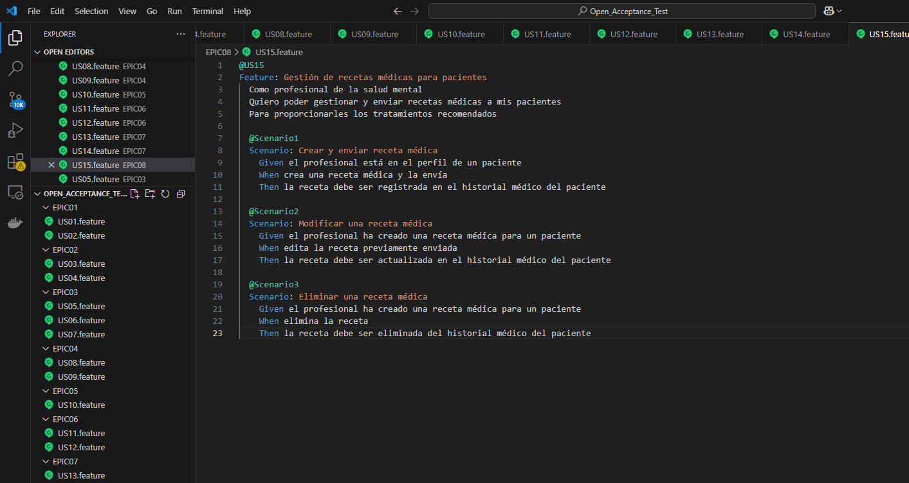

## 5.2. Landing Page, Services & Applications Implementation.

### 5.2.1. Sprint 1

#### 5.2.1.1. Sprint Planning 1.

<table align="center"  border="1" width="90%" style="text-align:center;">
    <tr align="left">
        <td>
            <b>Sprint #</b>
        </td>
        <td>
            <b>Sprint 1</b>           
        </td>
    </tr>
    <tr align="left">
        <td colspan="2">
            <b>Sprint Planning Background</b>
        </td>
    </tr>
    <tr align="left">
        <td>
            <b>Date</b>
        </td>
        <td>
            25/04/25   
        </td>
    </tr>
       <tr align="left">
        <td>
            <b>Time</b>
        </td>
        <td>
            10:00         
        </td>
    </tr>
       <tr align="left">
        <td>
            <b>Location</b>
        </td>
        <td>
            Modalidad Remota por Whatsapp  
        </td>
    </tr>
     </tr>
       <tr align="left">
        <td>
            <b>Prepared By</b>
        </td>
        <td>
            Integrantes OpenGG 
        </td>
    </tr>
    </tr>
       <tr align="left">
        <td>
            <b>Attendess (to planning meeting)</b>
        </td>
        <td>
            - Chavez Uribe, Ario Joel	 
            - Yair Christofer Aru Acevedo  
            - Diego Vicente Seminario Castillo  
            - Astuyauri Herencia Jhomar Cristian Elias  
            - Ccotarma Ttito Sihuar Eduardo Eusebio  
            - Joel Gerson Prudencio Alcantara  
        </td>
    </tr>
    </tr>
       <tr align="left">
        <td>
            <b>Sprint n - 1</b>
            <b>Review Summary</b>
        </td>
        <td>
            No existe un sprint anterior para realizar el review, siendo este el primer sprint a desarrollar.  
        </td>
    </tr>
    <tr align="left">
        <td>
            <b>Sprint n - 1</b>
            <b>Retrospective Summary</b>
        </td>
        <td>
          No existe un sprint anterior para realizar una retrospectiva. Sin embargo en base a lo avanzado debemos considerar prioridad en el buen desarrollo de las User Stories y el Product Backlog.
        </td>
    </tr>
    <tr align="left">
        <td colspan="2">
            <b>Sprint Goal & User Stories</b>
        </td>
    </tr>
      <tr align="left">
        <td>
            <b>Sprint 1 Velocity</b>
        </td>
        <td>
            6
        </td>
    </tr>
       <tr align="left">
        <td>
            <b>Sum of Story Points</b>
        </td>
        <td>
            6
        </td>
  </tr>
</table>

#### 5.2.1.2. Aspect Leaders and Collaborators.
| Username (GitHub)             | Nombre                                   |
|-------------------------------|------------------------------------------|
| Eduardo Sihuar Ccotarma Ttito | Eduardo Sihuar Ccotarma Ttito            |
| DiegoSeminario                | Diego Vicente Seminario Castillo         |
| Yair360                       | Yair Christofer Aru Acevedo              |
| feg06                         | Ario Joel Chavez Uribe                   |
| Jhomar Cristián Elias         | Jhomar Cristián Elias Astuyauri Herencia |
| joel5871                      | Joel Prudencio Alcantara                 |

#### 5.2.1.3. Sprint Backlog 1

| **US** | **Tarea** | **TID** | **Descripción de la tarea** | **Detalle** | **Horas estimadas** | **Autor** | **Estado** |
|--------|-----------|---------|-----------------------------|-------------|---------------------|-----------|------------|
| US01   | Desarrollo de sección de contacto | T01     | Agregar detalles de la sección de contacto | Desarrollar y diseñar la sección de contacto en la página | 4                   | Jhomar | Done |
|        |           | T02     | Conectar formulario de contacto con API | Configurar backend para enviar datos del formulario de contacto | 6                   | Jhomar | Done |
| US02   | Mejorar copywriting en todas las secciones | T03     | Actualizar textos de las secciones | Revisar y actualizar los textos de las secciones en la Landing Page | 4                   | Jhomar | Done |
|        |           | T04     | Revisión final de copys | Revisar el estilo y tono de los textos en todas las secciones | 5                   | Jhomar | Done |
| US03   | Agregar testimonios de clientes | T05     | Diseñar sección de testimonios | Crear el diseño y la estructura de la sección de testimonios | 6                   | Jhomar | Done |
|        |           | T06     | Conectar testimonios con base de datos | Configurar la base de datos para almacenar y mostrar testimonios | 6                   | Jhomar | Done |
| US04   | Agregar sección de beneficios y propuesta de valor | T07     | Crear estructura de sección de beneficios | Diseñar la estructura y contenido de la sección de beneficios | 5                   | Ario | Done |
|        |           | T08     | Implementar contenido de beneficios | Agregar los beneficios y ventajas a la sección de beneficios | 4                   | Ario | Done |
| US05   | Mejorar la sección "About Us" | T09     | Revisar contenido de "About Us" | Actualizar el contenido y diseño de la sección "About Us" | 6                   | Jhomar | Done |
|        |           | T10     | Conectar API con contenido de "About Us" | Configurar backend para mostrar información de la sección | 5                   | Diego Seminario | Done |
| US06   | Desarrollar la introducción y llamada a la acción (Header) | T11     | Diseñar Header con CTA | Desarrollar y diseñar la cabecera con llamada a la acción | 6                   | Sihuar | Done |
|        |           | T12     | Programar interactividad del CTA | Implementar la interactividad en la llamada a la acción | 4                   | Sihuar | Done |
| US07   | Contenido "What is it about?" | T13     | Agregar contenido descriptivo | Desarrollar contenido explicativo para la sección | 5                   | Diego Seminario | Done |
|        |           | T14     | Incorporar imágenes | Agregar imágenes relevantes a la sección | 5                   | Yair | Done |

#### 5.2.1.4. Development Evidence for Sprint Review.

A continuación, se muestran los commits realizados en el repositorio para el Landing Page, en el cual se puede observar el trabajo realizado por cada integrante del equipo.

Repositorio de la Landing Page en GitHub: <a href="https://1asi0729-2510-4317-g2-opengg.github.io/Landing-Page/">Enlace_Repositorio</a>

| **Repository** | **Branch** | **Commit ID** | **Author** | **Time ago** |
|----------------|------------|---------------|------------|--------------|
| PSYMED         | feature/contact | 01f3c6eee18bf252148bf982586bfb5ea02c9209 | Jhomar | 3 days ago |
| PSYMED         | feature/improve_copywriting | 17fec8d50543faf5e1f0ac9d0b6ef66a3d47827d | Jhomar | 3 days ago |
| PSYMED         | features/testimonies | 9a58a0b582615577311a454d56f4f125731e94a4 | Jhomar | 3 days ago |
| PSYMED         | feature/benefit_value_proposition_advantages | 7bb03010b2d9d5fec4d3e27b2dd504e1ea6334d7 | Ario | 3 days ago |
| PSYMED         | feature/about-us | 4c5ab4bb7a4fcb7171fb8817ccd1c5faf1868257 | Jhomar | add: about-us-detail | 3 days ago |
| PSYMED         | develop | 2bc526028cd6f873c0261424960e18e1a06af480 | Sihuar | chore: add gitignore | 3 days ago |
| PSYMED         | feature/description_startup | 2a188277e507357b9d34f0066082336d718f0ffc | Sihuar  | 3 days ago |
| PSYMED         | feature/Introduccion-call_to_action-header | a639476ca75e0f61f993c9c59fe9560ac6dca003 | Sihuar  | 3 days ago |

#### 5.2.1.5. Execution Evidence for Sprint Review.

En esta sección, se evidenciará el deploy de la Landing Page ingresando al siguiente link: 
- Landing Page: https://1asi0729-2510-4317-g2-opengg.github.io/Landing-Page/

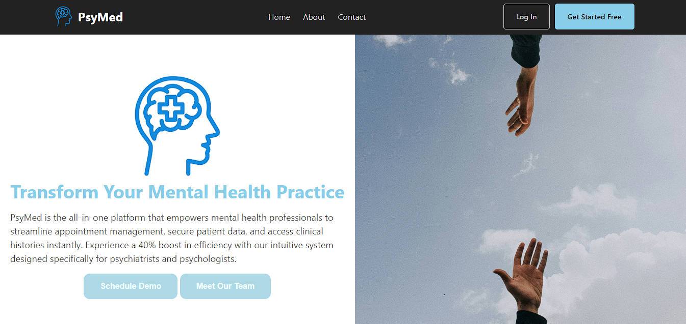
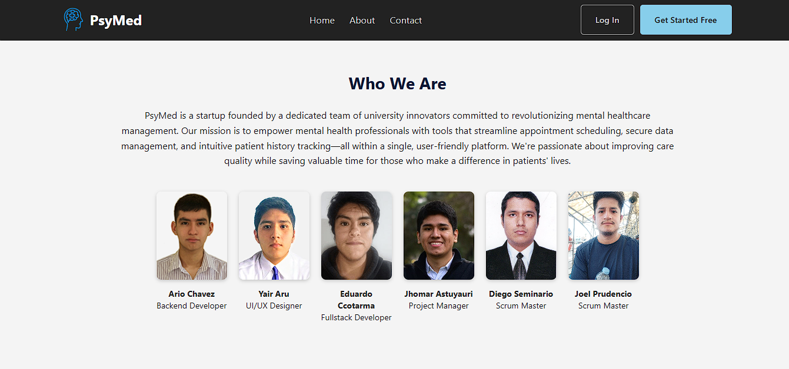
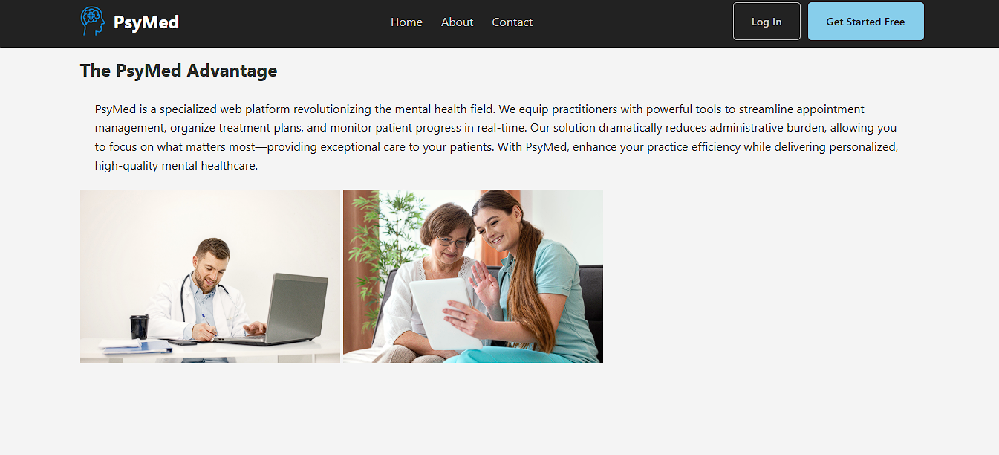
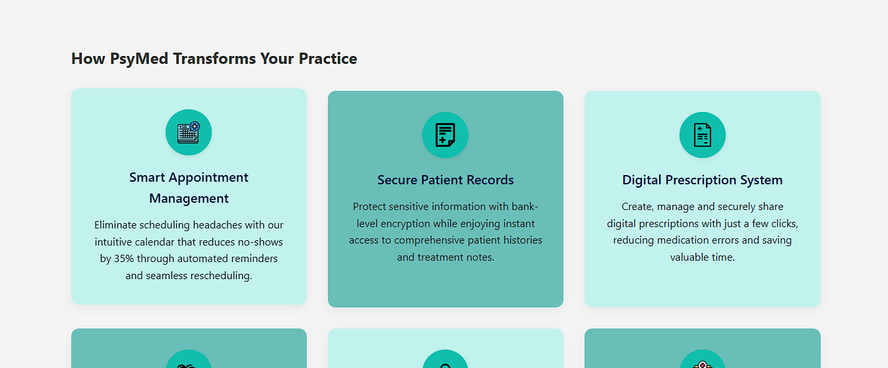
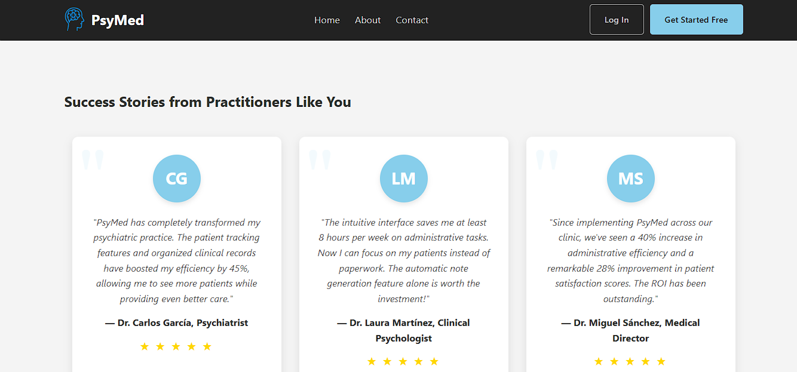
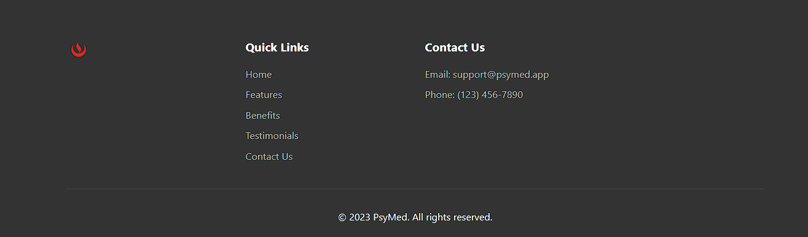

#### 5.2.1.6. Services Documentation Evidence for Sprint Review.

Para este primer Sprint, solo se implementa y despliega la Landing Page, por lo que no se utilizó endpoints.

#### 5.2.1.7. Software Deployment Evidence for Sprint Review.

Durante el desarrollo de este Sprint, se logró desplegar exitosamente la Landing Page de PsyMed. Esto permitirá que los posibles usuarios puedan informarse sobre nuestra plataforma y aumentar su interes en la misma. Además de proporcionar la posibilidad de enviarnos un mensaje directo por si tiene alguna duda en especifico. Para el correcto despliegue se utilizó GitHub Pages.

Primero, ingresamos a los repositorios de la organización y seleccionamos la de la Landing Page.

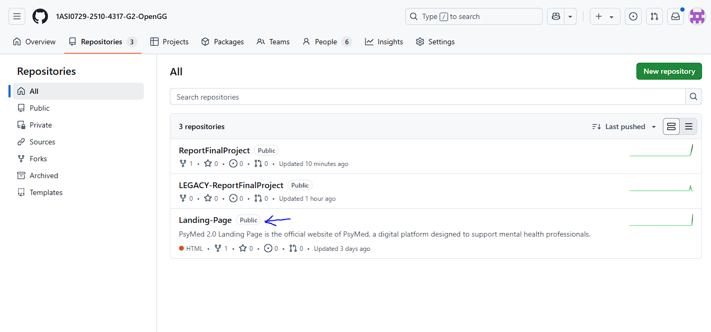

Luego, ingresamos a la sección Settings.

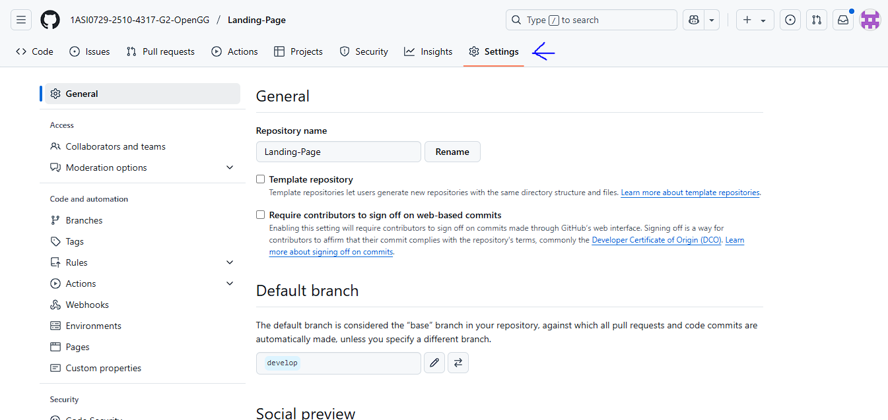

Después, seleccionamos la opción Pages.

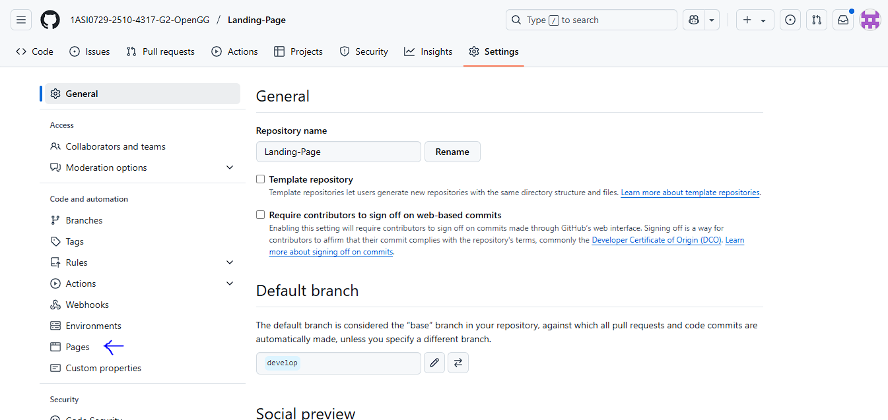

Dentro de Pages, seleccionamos el source y elegimos la opcion "Deploy from a branch", luego seleccionamos la rama y lo guardamos.

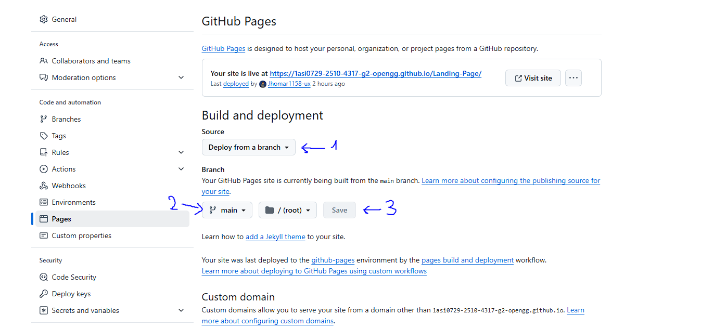

Finalmente, escribimos el nombre de nuestro dominio y lo guardamos. Con ello, se realiza el deployment de la Landing Page.

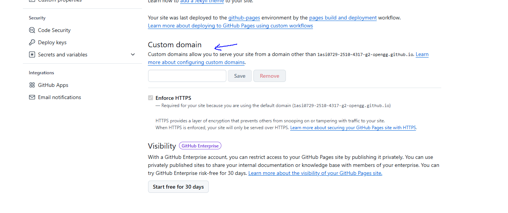

#### 5.2.1.8. Team Collaboration Insights during Sprint.

En esta parte, se mostrará la participación de los integrantes del grupo para la elaboración de este sprint 1:
Report:

Landing Page:

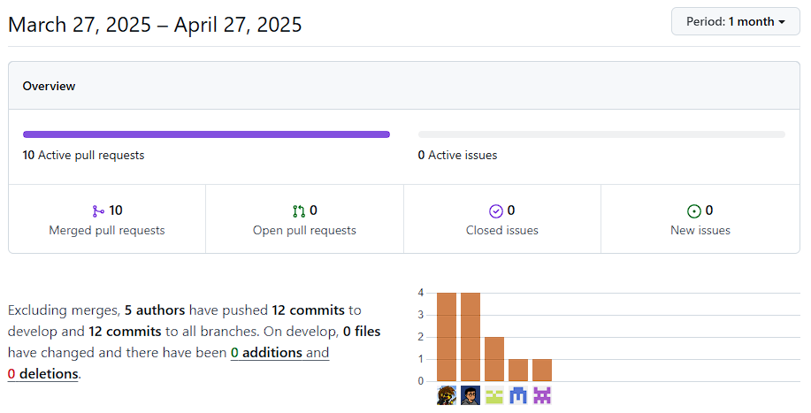

### 5.2.2. Sprint 2
#### 5.2.2.1. Sprint Planning 2.
<table align="center"  border="1" width="90%" style="text-align:center;">
    <tr align="left">
        <td>
            <b>Sprint #</b>
        </td>
        <td>
            <b>Sprint 2</b>           
        </td>
    </tr>
    <tr align="left">
        <td colspan="2">
            <b>Sprint Planning Background</b>
        </td>
    </tr>
    <tr align="left">
        <td>
            <b>Date</b>
        </td>
        <td>
            16/05/25   
        </td>
    </tr>
       <tr align="left">
        <td>
            <b>Time</b>
        </td>
        <td>
            10:00         
        </td>
    </tr>
       <tr align="left">
        <td>
            <b>Location</b>
        </td>
        <td>
            Modalidad Remota por Whatsapp  
        </td>
    </tr>
     </tr>
       <tr align="left">
        <td>
            <b>Prepared By</b>
        </td>
        <td>
            Integrantes OpenGG 
        </td>
    </tr>
    </tr>
       <tr align="left">
        <td>
            <b>Attendess (to planning meeting)</b>
        </td>
        <td>
            - Chavez Uribe, Ario Joel	 
            - Yair Christofer Aru Acevedo  
            - Diego Vicente Seminario Castillo  
            - Astuyauri Herencia Jhomar Cristian Elias  
            - Ccotarma Ttito Sihuar Eduardo Eusebio  
            - Joel Gerson Prudencio Alcantara  
        </td>
    </tr>
    </tr>
       <tr align="left">
        <td>
            <b>Sprint n - 2</b>
            <b>Review Summary</b>
        </td>
        <td>
            Creación de un nuevo repositorio para el Frontend y asignación de tareas para implementar sus funciones para los pacientes y profesionales de salud mental.  
        </td>
    </tr>
    <tr align="left">
        <td>
            <b>Sprint n - 1</b>
            <b>Retrospective Summary</b>
        </td>
        <td>
          Realización de la primera versión del Landing y documentación de las tareas y los cambios realizados
        </td>
    </tr>
    <tr align="left">
        <td colspan="2">
            <b>Sprint Goal & User Stories</b>
        </td>
    </tr>
      <tr align="left">
        <td>
            <b>Sprint 2 Velocity</b>
        </td>
        <td>
            207
        </td>
    </tr>
       <tr align="left">
        <td>
            <b>Sum of Story Points</b>
        </td>
        <td>
            37
        </td>
  </tr>
</table>

#### 5.2.2.2. Aspect Leaders and Collaborators.
| Username (GitHub)             | Nombre                                   |
|-------------------------------|------------------------------------------|
| Eduardo Sihuar Ccotarma Ttito | Eduardo Sihuar Ccotarma Ttito            |
| DiegoSeminario                | Diego Vicente Seminario Castillo         |
| Yair360                       | Yair Christofer Aru Acevedo              |
| feg06                         | Ario Joel Chavez Uribe                   |
| Jhomar Cristián Elias         | Jhomar Cristián Elias Astuyauri Herencia |
| joel5871                      | Joel Prudencio Alcantara                 |

#### 5.2.2.3. Sprint Backlog 2

| **US** | **Tarea**                                               | **TID** | **Descripción de la tarea**                                              | **Detalle**                                                                 | **Horas estimadas** | **Autor**       | **Estado** |
|--------|---------------------------------------------------------|---------|--------------------------------------------------------------------------|------------------------------------------------------------------------------|---------------------|-----------------|------------|
| 8      | Crear formulario de emociones                           | T001    | UI para ingresar emociones del paciente                                 | Campos: emoción, fecha, observaciones                                      | 5                   |  Sihuar  |      Done      |
|        | Almacenar emociones en backend                          | T002    | Enviar datos a fake API                                                  | POST usando Axios                                                           | 6                   | Sihuar  |    Done        |
|        | Mostrar feedback visual                                 | T003    | Mostrar confirmación de guardado o error                                | Uso de PrimeToast                                                           | 4                   |  Sihuar  |     Done       |
| 9      | Crear formulario de indicadores biológicos              | T004    | UI para registrar funciones: sueño, apetito, etc.                        | Uso de sliders/selects y fecha                                              | 6                   |  Sihuar  |    Done        |
|        | Enviar indicadores al backend                           | T005    | Conexión a fake API                                                      | Validaciones mínimas                                                        | 5                   | Jhomar   |      Done      |
| 10     | Crear vista para modificar acceso de paciente           | T006    | Formulario de edición de credenciales                                   | Email, contraseña (solo editable por profesional)                          | 6                   |  Jhomar   |      Done      |
|        | Validar datos de acceso                                 | T007    | Validaciones de email y contraseña                                      | Regex y condiciones mínimas                                                 | 4                   |  Jhomar    |     Done       |
| 11     | Crear vista de perfil editable del profesional          | T008    | Formulario con nombre, especialidad, contacto                           | Editable por el propio profesional                                          | 5                   | Sihuar    |     Done       |
|        | Guardar datos personales en backend                     | T009    | PUT/PATCH a fake API                                                     | Feedback visual                                                             | 4                   |  Todos  |    Done        |
| 12     | Implementar vista de login para paciente                | T010    | Formulario de login con email y contraseña                              | Con validaciones básicas y conexión a fake API                             | 6                   |  Sihuar |       Done     |
|        | Mostrar errores de autenticación                        | T011    | Notificaciones en caso de error en credenciales                         | PrimeToast y control visual                                                 | 4                   | Jhomar    |     Done       |
| 13     | Crear login para profesional                            | T012    | Similar al login de paciente, pero redirige a otra vista                | Validaciones y fake API                                                     | 6                   | Jhomar   |    Done        |
|        | Mostrar errores de autenticación                        | T013    | Feedback visual                                                          | Mensaje de error                                                            | 4                   | Sihuar   |      Done      |
| 14     | Crear formulario para registrar datos del paciente      | T014    | Campos: nombre, edad, género, contacto                                  | Validación de campos                                                        | 6                   | Yair  |      Done      |
|        | Guardar datos del paciente                              | T015    | POST a fake API                                                          | PrimeVue + Axios                                                            | 5                   | Jhomar   |     Done       |
| 15     | Crear formulario para registrar medicamentos            | T016    | Campos: nombre del medicamento, dosis, frecuencia, duración             | Validaciones mínimas                                                        | 6                   | Ario    |      Done      |
|        | Enviar medicamentos al backend                          | T017    | POST a fake API                                                          | Mostrar feedback de éxito o error                                           | 5                   |   Jhomar  |     Done       |
| 16     | Crear formulario para registrar historial del paciente  | T018    | Campos como enfermedades previas, antecedentes familiares, etc.         | TextArea o inputs                                                           | 6                   | Todos  |      Done      |
|        | Guardar historial en backend                            | T019    | POST usando Axios                                                        | Confirmación en pantalla                                                    | 5                   | Jhomar   |     Done       |
| 17     | Crear vista con gráficos de estadísticas biológicas     | T020    | Mostrar datos en gráficos (lineal o circular)                           | Chart.js o PrimeVue Chart                                                   | 7                   | Sihuar    |      Done      |
|        | Obtener datos del backend                               | T021    | GET desde fake API                                                       | Normalización de datos                                                      | 5                   |  Jhomar  |     Done       |
|        | Crear formulario de actualización de apuntes terapéuticos| T028   | Campo de texto para notas terapéuticas                                  | Rich Text opcional                                                          | 6                   | Jhomar   |      Done      |
|        | Enviar notas al backend                                 | T029    | POST o PUT a fake API                                                    | Confirmación y validaciones                                                 | 4                   | Sihuar   |     Done       |
| 18     | Crear vista con estados de ánimo del paciente           | T022    | Listar registros emocionales en orden cronológico                       | Vista tipo timeline                                                         | 6                   |  Jhomar  |      Done      |
|        | Conexión con backend                                    | T023    | GET desde fake API                                                       | Manejo de carga y errores                                                   | 5                   |  Sihuar   |     Done       |
|        | Crear inicio de sesión para pacientes                   | T030    | Similar a US06 pero con otro endpoint/flujo                             | Formulario + validación                                                     | 5                   |  Sihuar   |      Done      |
|        | Conexión con backend para login                         | T031    | POST a fake API + respuesta                                              | Control de errores                                                          | 4                   | Sihuar  |     Done       |
| 19     | Crear vista con consumo de medicamentos                 | T024    | Mostrar nombre, dosis, frecuencia y cumplimiento                        | Listado simple o tabla                                                      | 5                   | Diego    |     Done       |
|        | Obtener datos del backend                               | T025    | GET desde fake API                                                       | Feedback visual                                                             | 4                   | Sihuar   |    Done        |
|        | Implementar DELETE de paciente en API RESTful           | T032    | Lógica y endpoint para eliminar registros                               | Simular con JSON server o fake backend                                     | 6                   |  Todos  |     Done       |
| 20     | Crear formulario de actualización de dosis              | T026    | Permitir editar dosis y frecuencia de medicamentos                      | Campos editables + validación                                               | 6                   |  Joel   |    Done        |
|        | Enviar cambios al backend                               | T027    | PUT/PATCH a fake API                                                     | Confirmación de cambios                                                     | 5                   |  Sihuar   |    Done        |
|        | Implementar DELETE de profesional en API RESTful        | T033    | Lógica y endpoint para eliminar profesionales                           | Simulación en backend                                                       | 6                   | Todos   |    Done        |

#### 5.2.2.4. Development Evidence for Sprint Review.

A continuación, se muestran los commits realizados en el repositorio para el Frontend, en el cual se puede observar el trabajo realizado por cada integrante del equipo.

Repositorio del Frontend en GitHub: <a href="https://github.com/1ASI0729-2510-4317-G2-OpenGG/OPGG-Frontend-Psymed.git">Enlace_Repositorio</a>

| **Repository** | **Branch** | **Commit ID** | **Author** | **Time ago** |
|----------------|------------|---------------|------------|--------------|
| PSYMED         | login_dashboard | 4968d726d217727cad4d81e9c295ff04201979ef | Jhomar | 1 days ago |
| PSYMED         | medications | b79444158bbbc84d5d8c7125c75aea316188042c | Ario | 1 days ago |
| PSYMED         | formEntriesDates/Patients | 6ce1f12cc3206cf4e2b126950113701716d3fbe4 | Diego | 1 days ago |
| PSYMED         | feature/patients-profile | 8cb583c123f94769edd1f62bb9003ec0538dc1dc | Yair | 1 days ago |
| PSYMED         | develop | 3bf5755773f340fdb3df69372b2f70a8ae48cc9c | Sihuar | 1 days ago |

#### 5.2.2.5. Execution Evidence for Sprint Review.

#### 5.2.2.6. Services Documentation Evidence for Sprint Review.

Durante el **Sprint 2**, el enfoque principal se centró en el desarrollo del **frontend** de la aplicación. En este ciclo se implementaron:

- Todos los **componentes** de la interfaz de usuario.
- Los **servicios** necesarios para la comunicación con los datos.
- Integración con una **fake API** para simular operaciones reales dentro de la aplicación.

Puedes acceder a nuestra fake API en el siguiente enlace: [JSON Server - PsyMed](https://json-server-psymed.vercel.app/)

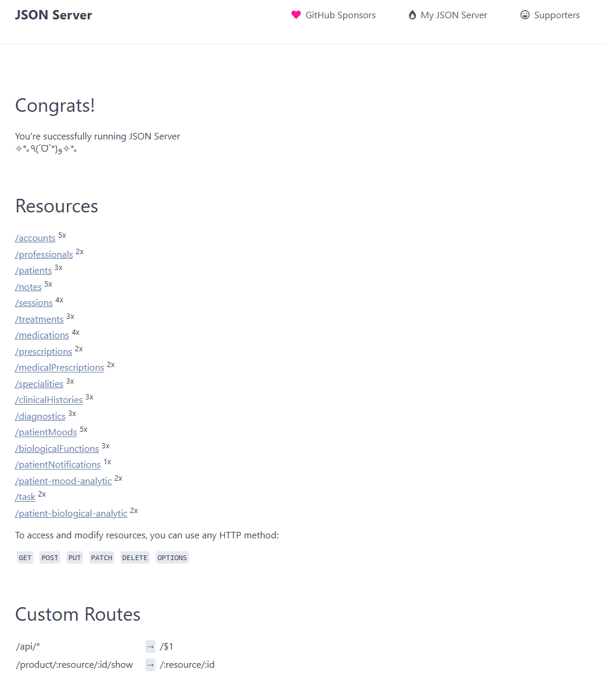

#### 5.2.2.7. Software Deployment Evidence for Sprint Review.

Durante el desarrollo de este Sprint, se logró desplegar exitosamente el Frontend de PsyMed. Esto permitirá que los posibles usuarios puedan interactuar con nuestra plataforma de manera satisfactoria y lograr su atención. Además de la posibilidad de interactuar un mensaje directo por si tiene alguna duda en especifico. Para el correcto despliegue se utilizó Netlify.

Primero, ingresamos a la configuración de Netlify y seleccionamos la de nuestro Frontend.

Luego, ingresamos a la sección Deploys.

Después, En proyect configuración, llamamos a la aplicación para su visualización.

Finalmente, cargamos el proyecto y vemos el resultado

#### 5.2.2.8. Team Collaboration Insights during Sprint.

En esta parte, se mostrará la participación de los integrantes del grupo para la elaboración de este sprint 2:

Report:
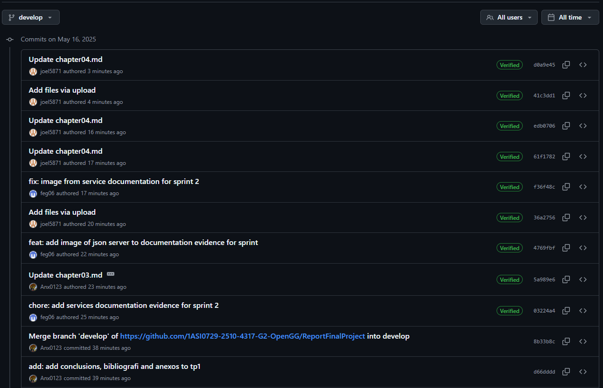

Frontend:

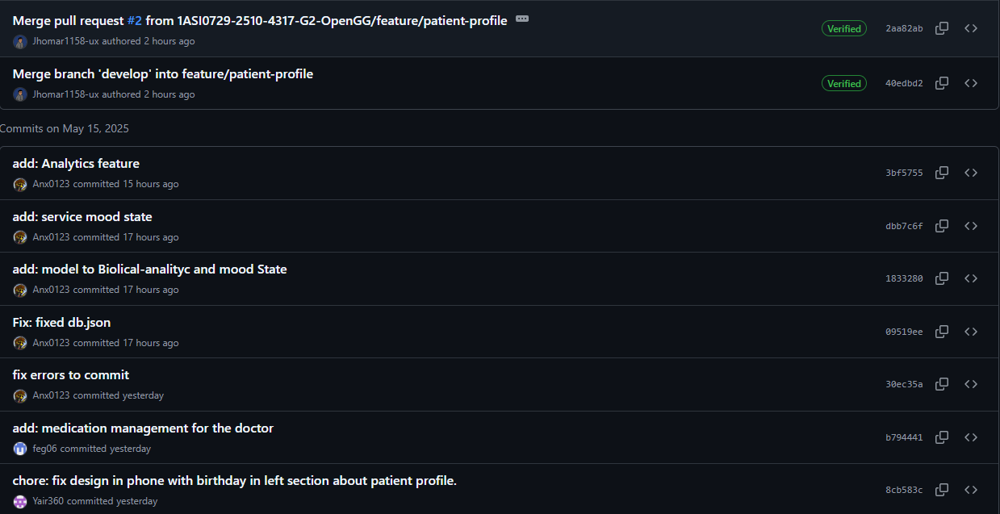

# Conclusiones

**TB1:**
La primera entrega del proyecto Psymed ha permitido establecer una base sólida tanto conceptual como técnica para el desarrollo del sistema. Se logró identificar claramente la problemática y necesidades del usuario mediante entrevistas y análisis, lo que guió la creación de historias de usuario y un product backlog bien estructurado. El equipo implementó un flujo de trabajo eficiente con Gitflow y Conventional Commits, asegurando orden en el desarrollo y colaboración a través de GitHub. Además, se avanzó en el diseño visual y la funcionalidad inicial de la landing page, con una propuesta centrada en la experiencia del usuario. La documentación fue realizada cuidadosamente siguiendo el formato APA, garantizando coherencia y claridad en todo el informe. Esto proporciona una dirección clara para las próximas etapas del proyecto.

**TP1:**
En esta segunda entrega, se logró implementar una mejora continua basada en las observaciones y aprendizajes obtenidos durante la primera entrega. A partir de dichas consideraciones, se diseñó y ejecutó el Sprint 2, lo cual permitió avanzar en la creación y diseño de la primera versión del frontend. Asimismo, se completó exitosamente el deploy tanto del frontend como de la API mediante json-server, lo que permitió validar la funcionalidad y la comunicación entre los componentes sin depender de un backend completo. Este enfoque ágil contribuyó a una evolución efectiva del proyecto, manteniendo la calidad y la eficiencia en cada etapa del desarrollo.

# Bibliografía
Contributors, M. o. J. T. A. B. (s.f.). Bootstrap. https://getbootstrap.com/

Conventional commits. (s.f.). Conventional Commits. https://www.conventionalcommits.org/en/v1.0.0/

Figma Community: Explore templates, plugins, and widgets published by the community. (s. f.). Figma. https://www.figma.com/community

Free Line Icons for Designers and Developers - Lineicons. (2021, 23 mayo). Lineicons. https://lineicons.com/

Pallerols, X. M. (2022, 18 noviembre). Qué es el Responsive Design y por qué tu web debería serlo. Thinking For Innovation. https://www.iebschool.com/blog/que-es-responsive-web-design-analitica-usabilidad/

Vue.js. (s.f.). The Progressive JavaScript Framework | Vue.js. https://vuejs.org/

npm: json-server. (s.f.). Npm. https://www.npmjs.com/package/json-server

Dashboard. (s.f.). Vercel. https://vercel.com/guardiandeitys-projects

# Anexos
Entevistas: [Entrevistas hechas](https://upcedupe-my.sharepoint.com/:v:/g/personal/u202213468_upc_edu_pe/Ee7CIOQMlkxJhj-bC7_g3N0Bs9_gFqaSF9CBj9IS1hkSGQ?e=1CWcrr&nav=eyJyZWZlcnJhbEluZm8iOnsicmVmZXJyYWxBcHAiOiJTdHJlYW1XZWJBcHAiLCJyZWZlcnJhbFZpZXciOiJTaGFyZURpYWxvZy1MaW5rIiwicmVmZXJyYWxBcHBQbGF0Zm9ybSI6IldlYiIsInJlZmVycmFsTW9kZSI6InZpZXcifX0%3D)

Repositorio: https://github.com/1ASI0729-2510-4317-G2-OpenGG

Landing Page: https://1asi0729-2510-4317-g2-opengg.github.io/Landing-Page/

figma: https://www.figma.com/design/Vz60AoPOo718hrLAxbAB02/Open-Source-psymed-OPGG?node-id=61-79&t=hoCqkbgGZ3OU4gT4-1

canvas ppt: https://www.canva.com/design/DAGlvhfxT8o/lS45yxlZMDVOQFJaOsvwnw/edit?utm_content=DAGlvhfxT8o&utm_campaign=designshare&utm_medium=link2&utm_source=sharebutton

Fake Api: https://json-server-psymed.vercel.app/

trello: https://trello.com/b/pDKhIadm/app-web
