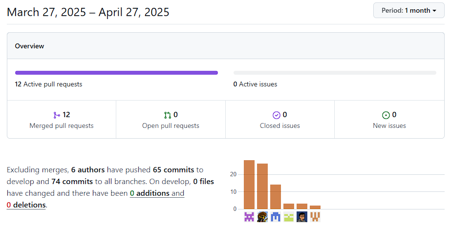

# Capítulo V: Product Implementation, Validation & Deployment.
## 5.1. Software Configuration Management.

### 5.1.1. Software Development Environment Configuration.

### 5.1.2. Source Code Management.

Para el desarrollo del producto, utilizamos Gitflow para la organización de las ramas con los puntos a desarrollar durante el proyecto.
Para los repositorios se utilizó GitHub, para llevar un registro de los cambios realizados en las tareas asignadas siendo en este caso un repositorio para Report y otro para la Landing Page desplegada.

- URL del repositorio Report en GitHub: https://github.com/1ASI0729-2510-4317-G2-OpenGG/ReportFinalProject
- URL del repositorio Landing Page en GitHub: https://github.com/1ASI0729-2510-4317-G2-OpenGG/Landing-Page

### 5.1.3. Source Code Style Guide & Conventions.

### 5.1.4. Software Deployment Configuration.

## 5.2. Landing Page, Services & Applications Implementation.

### 5.2.1. Sprint 1

#### 5.2.1.1. Sprint Planning 1.

#### 5.2.1.2. Aspect Leaders and Collaborators.

#### 5.2.1.3. Sprint Backlog 1.

#### 5.2.1.4. Development Evidence for Sprint Review.

#### 5.2.1.5. Execution Evidence for Sprint Review.

En esta sección, se evidenciará el deploy de la Landing Page ingresando al siguiente link: 
- Landing Page: https://1asi0729-2510-4317-g2-opengg.github.io/Landing-Page/

#### 5.2.1.6. Services Documentation Evidence for Sprint Review.

Para este primer Sprint, solo se implementa y despliega la Landing Page, por lo que no se utilizó endpoints.

#### 5.2.1.7. Software Deployment Evidence for Sprint Review.

Durante el desarrollo de este Sprint, se logró desplegar exitosamente la Landing Page de PsyMed. Esto permitirá que los posibles usuarios puedan informarse sobre nuestra plataforma y aumentar su interes en la misma. Además de proporcionar la posibilidad de enviarnos un mensaje directo por si tiene alguna duda en especifico. Para el correcto despliegue se utilizó GitHub Pages.

Primero, ingresamos a los repositorios de la organización y seleccionamos la de la Landing Page.

Luego, ingresamos a la sección Settings.

Después, seleccionamos la opción Pages.

Dentro de Pages, seleccionamos el source y elegimos la opcion "Deploy from a branch", luego seleccionamos la rama y lo guardamos.

Finalmente, escribimos el nombre de nuestro dominio y lo guardamos. Con ello, se realiza el deployment de la Landing Page.

#### 5.2.1.8. Team Collaboration Insights during Sprint.

En esta parte, se mostrará la participación de los integrantes del grupo para la elaboración de este sprint 1:

| Username (GitHub)             | Nombre                                   |
|-------------------------------|------------------------------------------|
| Eduardo Sihuar Ccotarma Ttito | Eduardo Sihuar Ccotarma Ttito            |
| DiegoSeminario                | Diego Vicente Seminario Castillo         |
| Yair360                       | Yair Christofer Aru Acevedo              |
| feg06                         | Ario Joel Chavez Uribe                   |
| Jhomar Cristián Elias         | Jhomar Cristián Elias Astuyauri Herencia |
| joel5871                      | Joel Prudencio Alcantara                 |

Report:

Landing Page:

# Conclusiones

# Bibliografía

# Anexos